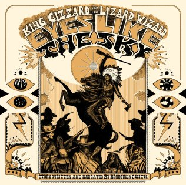

+++
title = "Eyes Like The Sky, 2013"
+++

> The bad white men call him the devil  
> The Yavapai call him "Eyes Like the Sky"

This truly unique Spaghetti Western soundtrack uses spoken narration rather than sung lyrics. It is a collaboration with Broderick Smith who wrote and narrated the story, and is the father of band member Ambrose.

What to listen to next:

*   [If you want a totally different narration based album](/gizzverse-guide/motu)
*   [If you want some more soundtrack style songs](/gizzverse-guide/oddments)
*   [If you want to hear the one other song that sounds like this](/gizzverse-guide/12bb)
