+++
title = "The Gizzverse Guide"
author = "@BoilerRhapsody"
+++

How do you get into King Gizzard and the Lizard Wizard? Many hear a small sample of this incredible band, but are immediately turned off when faced with what to listen to next out of such a high volume of material.

Welcome to the Gizzverse Guide, a catalogue of KGATLW releases, each with an introductory blurb that establishes its significance within the overall discography. Each entry is linked by attributes that you can use to take you to the next listening suggestion, based on what you already know or like about the music.

**What To Do:**

*   If you have already heard an album and don’t know where to go from there, navigate to it from the contents list below then follow the prompts (The back button will take you back to the previous album).
*   If you are completely new to the band, have heard nothing and don’t know where to start, check out some of the [strategies](/gizzverse-guide/strategies).

Contents
--------

*   [Strategies to get into KGATLW](/gizzverse-guide/strategies)
*   [Band Biography](/gizzverse-guide/bio)
*   **Canonical Albums** — The main output of the band. Most groups never make so many albums in a full career, so it is this feat that KGATLW will go down in history for. There is something for everyone in this discography, the home of the ‘Gizzverse’. But this extended universe must be experienced to be understood, so more on that as we go.
    *   [12 Bar Bruise](/gizzverse-guide/12bb)
    *   [Eyes Like the Sky](/gizzverse-guide/elts)
    *   [Float Along — Fill Your Lungs](/gizzverse-guide/fafl)
    *   [Oddments](/gizzverse-guide/oddments)
    *   [I’m in Your Mind Fuzz](/gizzverse-guide/iiymf)
    *   [Quarters!](/gizzverse-guide/quarters)
    *   [Paper Mâché Dream Balloon](/gizzverse-guide/pmdb)
    *   [Nonagon Infinity](/gizzverse-guide/ni)
    *   [Flying Microtonal Banana](/gizzverse-guide/fmb)
    *   [Murder of the Universe](/gizzverse-guide/motu)
    *   [Sketches of Brunswick East](/gizzverse-guide/sobe)
    *   [Polygondwanaland](/gizzverse-guide/polygondwanaland)
    *   [Gumboot Soup](/gizzverse-guide/gs)
    *   [Fishing for Fishies](/gizzverse-guide/fff)
    *   [Infest the Rats’ Nest](/gizzverse-guide/itrn)
    *   [K.G.](/gizzverse-guide/kg)
    *   [L.W.](/gizzverse-guide/lw)
    *   [Butterfly 3000](/gizzverse-guide/b3000)
    *   [Omnium Gatherum](/gizzverse-guide/og)
    *   [Ice, Death, Planets, Lungs, Mushrooms and Lava](/gizzverse-guide/idplmal)
    *   [Made In Timeland](/gizzverse-guide/mit)
    *   [Laminated Denim](/gizzverse-guide/ld)
    *   [Changes](/gizzverse-guide/changes)
*   **Non-Canonical Releases**
    *   [Willoughby’s Beach](/gizzverse-guide/wb)
    *   [Butterfly 3001](/gizzverse-guide/b3001)
    *   [Chunky Shrapnel](/gizzverse-guide/cs)
    *   [Live in San Francisco ’16](/gizzverse-guide/lisf)
    *   [Satanic Slumber Party](/gizzverse-guide/ssp)
*   **Official Bootlegger Program**
    *   [Demos Vol. 1 – Music To Kill Bad People To, 2020](/gizzverse-guide/demos1)
    *   [Demos Vol. 2 – Music To Eat Bananas To](/gizzverse-guide/demos2)
    *   [Demos Vol. 3 – Music To Eat Pond Scum To](/gizzverse-guide/demos3)
    *   [Demos Vol. 4 – Music To Die To](/gizzverse-guide/demos4)
    *   [Teenage Gizzard](/gizzverse-guide/tg)
    *   [Live In Paris ’19](/gizzverse-guide/lipar19)
    *   [Live In Adelaide ’19](/gizzverse-guide/liade19)
    *   [Live In Brussels ’19](/gizzverse-guide/libru19)
    *   [Live In Asheville ’19](/gizzverse-guide/liash19)
    *   [Live In London ’19](/gizzverse-guide/lilon19)
    *   [Live In Melbourne ’21](/gizzverse-guide/limel21)
    *   [Live In Sydney ’21](/gizzverse-guide/lisyd21)
    *   [Live In Brisbane ’21](/gizzverse-guide/libri22)
    *   [Live In Milwaukee ’19](/gizzverse-guide/limil19)
    *   [Live At Levitation ’14](/gizzverse-guide/lalev14)
    *   [Live At Levitation ’16](/gizzverse-guide/lalev16)
    *   [Live At Bonnaroo ’22](/gizzverse-guide/labon22)
*   **Related Projects** — So you’ve completed the KGATLW catalogue and don’t know where to go next? Between band member side projects, past iterations, and a wide spread of collaborators and friends, there is a much bigger world waiting your discovery.
    *   [The Murlocs](/gizzverse-guide/the-murlocs)
*   [What is the Gizzverse?](/gizzverse-guide/what-is-the-gizzverse)
*   [About The Gizzverse Guide](/gizzverse-guide/about)

### **Float Along — Fill Your Lungs, 2013 \[FAFYL\]**

> Just yesterday, I sat across from my legs  
> They weren't connected to me  
> And I couldn't see 'cause my eyes weren't in me  
> Hold me up straight while I screw my head on

The first true psychedelic album. A lo-fi throwback in sound to The Beatles’ Indian influenced era, thanks to the extensive use of a Sitar. This instrument was chosen as the first in a project to learn a new instrument every year, also marking the beginning of a discography wide fascination with sounds from ‘the East’.

What to listen to next:

*   [If you want an album of long, trippy jams](/gizzverse-guide/quarters)
*   [If you want more of the ‘Eastern’ sound](/gizzverse-guide/fmb)
*   [If you want more of the chill 60s Psych-Pop vibe](/gizzverse-guide/pmdb)
*   [If you want a bit more Rock in your Psych-Rock](/gizzverse-guide/iiymf)

I’m familiar with the main albums and want to go deeper:

*   [If you liked Head On/Pill and want a playlist of signature KGATLW long songs](https://open.spotify.com/playlist/77cYJha9ttoOpZkZQOCid6?si=28d4f5ace4ed476a) (Spotify link)

* * *

### **Oddments, 2014 \[ODD\]**

> It's kind of funny  
> That I live the poetry I can not write  
> But you, my beauty  
> Shall be fixed forever loosely in my heart

Oddments is a loose collection of lo-fi psych songs that were created outside of other whole album projects or for abandoned concepts. Representing several paths that the band never went down, these are some of the most unique KGATLW songs that tie up the loose ends of their early period for bigger and better sounding projects.

The first opus of Jason Galea, this intricate artwork spreads over the triple gatefold of the first vinyl issue with its own little world of idiosyncratic characters.

What to listen to next:

*   [If you want a newer more hi-fi eclectic concept-less album](/gizzverse-guide/gs)
*   [If you want the newest eclectic concept-less album](/gizzverse-guide/og)
*   [If you want to move on from the lo-fi early period](/gizzverse-guide/iiymf)
*   [If you want more chill songs](/gizzverse-guide/pmdb)
*   [If you want another ‘fun’ album](/gizzverse-guide/fff)

* * *

### **I’m In Your Mind Fuzz, 2014 \[IIYMF\]**

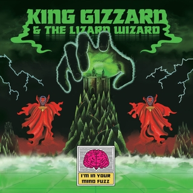

> When I’m in your mind  
> Then I’m in your mind  
> When I’m in your mind fuzz  
> Then I'm in your mind

With a clean Krautrock inspired foundation, KGATLW make their first big evolution with a pivot away from lo-fi production. IIYMF moves more confidently between driving and relaxed psychedelic sounds, and features the Flute as part of a project to learn a new instrument every year. The first album recorded in a professional studio, the first published internationally, and the first truly essential, realised, KGATLW album.

Traditionally recommended as the best starting point of the discography, it implements several ideas that would eventually coalesce into what is now known as the ‘Gizzverse’. These include visual elements of the album artwork and music videos, and seamless track medleys that link songwriting elements — Both aspects lay significant groundwork for imagery and concepts that are built upon in later albums.

What to listen to next:

*   [If you want the next ‘essential’ Gizzverse album](/gizzverse-guide/ni)
*   [If you liked the driving basslines of Krautrock influence](/gizzverse-guide/fmb)
*   [If you prefer a minimal studio mix for a cleaner sound](/gizzverse-guide/polygondwanaland)
*   [If you like the ‘slow jam’ tracks](/gizzverse-guide/quarters)

* * *

### **Quarters!, 2015 \[QRTS\]**

> Once you're in the zone  
> The river flows down like a full stone  
> Water is your bed  
> The ripples cushion your head

This slow, chill, Jazz-Rock album consists of four jams with a duration of 10 minutes and 10 seconds each. It is best known for fan-favourite track ‘The River’, that interpolates Dave Brubeck’s standard Take Five, establishing a fascination with time signatures that use odd numbers of beats.

What to listen to next:

*   [If you want a stronger jazz influence](/gizzverse-guide/sobe)
*   [If you don’t mind long songs with stoner vibes](/gizzverse-guide/fafl)
*   [If you want more loose, jazzy guitar jamming](/gizzverse-guide/idplmal)

I’m familiar with the main albums and want to go deeper:

*   [If you want a playlist of just long songs](https://open.spotify.com/playlist/77cYJha9ttoOpZkZQOCid6?si=28d4f5ace4ed476a) (Spotify link)

* * *

### [**Paper Mâché Dream Balloon, 2015**][PMDB]

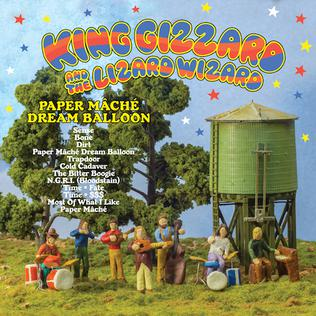

> But in fact it's a pattern  
> Everything I hear will always make me ashen  
> I know it's recognizable  
> But it don't make no sense at all, oh

This refreshing psych-pop album was recorded almost entirely on acoustic instruments for a quaint, folk-pop effect. The lyrics provide a dark undertone hinting at stories that highly contrast the sound. Showcases the Clarinet as part of a project to learn a new instrument every year.

What to listen to next:

*   [If you liked the brighter, positive sound](/gizzverse-guide/b3000)
*   [If you want another Pop-based album](/gizzverse-guide/changes)
*   [If you more relaxed 60s style](/gizzverse-guide/fafl)
*   [If you want a different ‘period’ sound](/gizzverse-guide/fff)
*   [If you prefer the tone of the music to match very dark, intense lyrics](/gizzverse-guide/itrn)

I’m familiar with the main albums and want to go deeper:

*   [If the guy who sings The Bitter Boogie sounds cool and you want to hear more](/gizzverse-guide/the-murlocs)

* * *

### **Nonagon Infinity, 2016 \[NI\]**

> Loosen up  
> Time to drop  
> Fuck shit up  
> Don't forget about it

‘Nonagon Infinity opens the door’, this self-mythologising nod to Aldous Huxley’s doors of perception plunges you straight into the album – a faster, more intense frontier of Heavy-Psych. The phrase also became the first big meme in the KGATLW fan base; who were now galvanized in song for the first time with a title: the ‘Weirdo Swarm’.

In several ways the sequel to [I’m In Your Mind Fuzz](/gizzverse-guide/iiymf), Nonagon Infinity was the next big international breakthrough since that album. As well as doubling down on a signature sound for the band, it was also the first true full-length concept record, successfully completing an idea abandoned during recording of IIYMF.

The record is titled for this concept, featuring nine songs that all seamlessly transition (including the last track back into the first), forming an endless loop. This cycle is signified by the nonagon on the album artwork, superimposed over the mountain castle also from the IIYMF cover, defining it as the linchpin of the Gizzverse – the scene now beginning to draw significance akin to several other pivotal high grounds of literature, such as those found in the universes of Stephen King, J.R.R. Tolkien, and H.P. Lovecraft.

What to listen to next:

*   [If you want the next Gizzverse album (heavier and more conceptual)](/gizzverse-guide/motu)
*   [If you want the album that best precedes this](/gizzverse-guide/iiymf)
*   [If you prefer less fuzz and more prog](/gizzverse-guide/polygondwanaland)
*   [If you want more energy and a heavier sound](/gizzverse-guide/itrn)
*   [If you want high energy and even more fuzz](/gizzverse-guide/12bb)

* * *

### **Flying Microtonal Banana, 2017 \[FMB\]**

> Look into the sky and see the pattern  
> Reflecting in your eye from a distance  
> Mirroring the stars are the atoms  
> Mixing up like a cocktail

Volume 1 of ‘Explorations into Microtonal Tuning’. Named after a custom yellow Flying V gifted to the band leader by a guitar maker friend, the instrument was made with a banana shaped head stock and custom fret board that included extra frets for microtonal scales based on the Bağlama. This Turkish folk instrument was the fourth (and would be the last) chosen in a project to learn a new instrument every year.

Now with a more familiar platform, a half complete Bağlama based folk album was scrapped, and the band customised their own set of instruments to accompany the microtones of the FMB. This Anatolian sound shines through another psychedelic Krautrock inspired album that instantly became a fan favourite with its theme of cosmic-horror environmentalism.

What to listen to next:

*   [If you want Volume 2 of ‘Explorations into Microtonal Tuning’](/gizzverse-guide/kg)
*   [If you want more ‘non-Western’ sounding instruments](/gizzverse-guide/fafl)
*   [If you want more environmental tones but heavier and more apocalyptic](/gizzverse-guide/itrn)
*   [If you want more environmentalism but less stylised and less fictionalised](/gizzverse-guide/fff)

* * *

### **Murder Of The Universe, 2017 \[MOTU\]**

> Despondent, lugubrious, no future  
> We turned our bodies to computer  
> We are our own nature, abuser  
> No future, computer, abuser

Perhaps the most unique record in the catalogue, MOTU is a dark, noisy, unashamed deep dive into the Gizzverse. Progressing through various forms of geeky psychedelic Metal, extensive spoken narration is used in conjunction with vocals. This narration is provided by the ‘Reticent Raconteur’ (folk singer-songwriter label mate Leah Senior), and text to speech software as ‘Han-Tyumi’ the ‘confused cyborg’. Between the lyrics and the poetry of the characters, an epic tale is spun in three acts, infamously dubbed ‘post-audiobook’ by music critic Anthony Fantano. It could be equally described as sci-fi metal opera – but the unavoidable fact is that MOTU defies description and must be heard to be comprehended.

What to listen to next:

*   [If you want the next Gizzverse album (clean and proggy)](/gizzverse-guide/polygondwanaland)
*   [If you want another heavy album but less weird](/gizzverse-guide/itrn)
*   [I feel like I missed whatever could have led up to this](/gizzverse-guide/ni)
*   [If you want another narrated story](/gizzverse-guide/elts)
*   [If you want to hear a little more from ‘The Reticent Raconteur’](/gizzverse-guide/polygondwanaland)
*   [If you want another more subtle appearance from Han-Tyumi ‘The Confused Cyborg’](/gizzverse-guide/sobe)
*   [I didn’t like this, give me something completely different](/gizzverse-guide/pmdb)

* * *

### **Sketches Of Brunswick East, 2017 \[SOBE\]**

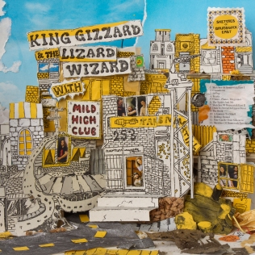

> So judge me by the page  
> But not by my cover  
> You’ll learn more with age  
> Like it or not, I live by the book

The first real stab at Jazz, its title is an homage to Miles Davis’ Sketches Of Spain. However, rather than channel Davis or any kind of more familiar fusion, the only ‘real’ jazz influence in the music actually comes with tinges of Funk from Ethiopia.

A collaborative album with Hypnagogic-psych-pop act Mild High Club, who played the 2016 iteration of the band’s now defunct showcase festival, Gizzfest. Alex Brettin (Of MHC) stuck around for a couple of weeks, and naturally some voice memo ‘sketches’ of songs materialised. With the sketches later completed by the band, the album retains the laid-back stoner fingerprints of MHC, tied together by the KGATLW signature ‘took too much’ weirdness.

What to listen to next:

*   [If you want more Jazz sounds](/gizzverse-guide/changes)
*   [If you want jazzy, stoner-psych rock](/gizzverse-guide/quarters)
*   [If you want more laid-back, ‘non-Western’ sounding songs](/gizzverse-guide/fafl)

* * *

### **Polygondwanaland, 2017 \[POLY\]**

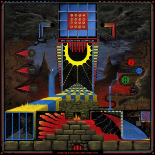

> We're gonna get there  
> Follow where the river runs  
> We're gonna get there  
> Polygondwanaland

Bias warning: This is the author’s favourite KGATLW album.

Polygondwanaland is hard to deny as the masterwork of the group, developed for at least three years, this extra care clearly shows in the end product. Clean, meticulous, proggy and mathy, the primary ‘gimmick’ is that the album is composed entirely in a dizzying array of polymeters and polyrythms (simply put, each musical voice plays in a different time signature).

This psychedelic folklore voyage both expands and deepens the Gizzverse in a multi-act structure that uses subtle spoken word narration to explore the vast sands of time.

Such a special album was deemed to get a special release, so as a gift to the fans, was given away for free; not just free as in ‘free beer’, but completely free of copyright under a creative commons attribution license, meaning anyone could (and still can!) create and sell their own edition of the album using the raw master files and art assets made available. At the time of writing, over 300 different editions are available on at least 15 formats (Including reel-to-reel, minidisc, floppy disc, and just about every existing size and type of vinyl record). Several record labels now exist that were established or launched just to publish this album that will forever hold a special place in the heart of many KGATLW fans.

What to listen to next:

*   [If you want the next Gizzverse album (technical and heavy)](/gizzverse-guide/itrn)
*   [If you want another strongly narrative driven multi-act album](/gizzverse-guide/motu)
*   [If you want more simple rhythmic interplay between synths and the band](/gizzverse-guide/b3000)
*   [If you liked the hints of folk and want more of just that](/gizzverse-guide/pmdb)
*   [If this was too ‘deep’ and you want to hear more of what led up to it](/gizzverse-guide/iiymf)

I’m familiar with the main albums and want to go deeper:

*   [If you like the unique release strategy and want to see how it developed][#Bootlegger]

* * *

### **Gumboot Soup, 2017 \[GS\]**

> Our minds unpack, muscles relax  
> We are superfluous, and in a stupor  
> We only fall asleep willingly  
> At the wheel that steers us into our future

After four studio albums and two international tours in 2017 alone, one would think KGATLW were done for the year. But never content to leave a project unfinished, something had to be done with all the extra material that either didn’t fit on, or was developed separate from the rest of the 2017 albums. Gumboot Soup is an eclectic mix of songs, some exist ‘between’ albums with the concept of one and the sound of another, others simply too good to rot in the vault waiting for a future project to fit into. Don’t be fooled into thinking of these as B-sides, Gumboot Soup is the high quality culmination of the insane project to release five studio albums in one calendar year, arriving just in time on the 31st of December.

What to listen to next:

*   [If you want an earlier lo-fi eclectic concept-less album](/gizzverse-guide/oddments)
*   [If you want the newest eclectic concept-less album](/gizzverse-guide/og)
*   [If you want an album full of heavy songs like ‘The Great Chain of Being’](/gizzverse-guide/itrn)
*   [If you want to hear the album ‘Superposition’ didn’t quite fit into](/gizzverse-guide/polygondwanaland)
*   [If you want to hear the album ‘All Is Known’ would’ve been](/gizzverse-guide/ni) on if it wasn’t made during [this one](/gizzverse-guide/fmb)
*   [If you liked the laid-back Pop sounds of Beginner’s Luck, I’m Sleepin’ In, and The Wheel](/gizzverse-guide/changes)

I’m familiar with the main albums and want to go deeper:

*   [If you want to hear more songs that lend a ‘peak behind the curtain’ of the creative process](/gizzverse-guide/demos1)

* * *

### **Fishing For Fishies, 2019 \[FFF\]**

> Fishing for fishies  
> Don't make them feel happy  
> Or me neither  
> I feel so sorry for fishies

Three different songs contain the word ‘boogie’ in this track list, which probably tells you most of what you need to know going in to this Roots-Rock camping album. Very underrated in the discography, this anachronistic gem begs the listener to not take the music so seriously, and likely wont be enjoyed if you aren’t willing to have fun listening to it. This carefree sound is offset by genuine, stark concern for the environment and mental well being in the lyrics.

The strong environmental anti-consumerism theme deserves credit for spurring the realisation of hypocrisy in producing so much waste as a by product of the vinyl record industry. Every record since this album is packaged in recycled materials, and usually available on recycled vinyl as well.

What to listen to next:

*   [If you want something else fun/not serious sounding](/gizzverse-guide/oddments)
*   [If you want another bright sounding album with dark lyrics](/gizzverse-guide/pmdb)
*   [If you want another easy-going album that gets weird](/gizzverse-guide/sobe)
*   [If you want another album that sounds last a past era](/gizzverse-guide/fafl)
*   [If you want another environmentalism themed album but more apocalyptic](/gizzverse-guide/fmb)
*   [If you didn’t like this and want to get into what the band is better known for](/gizzverse-guide/ni)

* * *

### **Infest The Rats’ Nest, 2019 \[ITRN\]**

> Open your eyes and light the fluid  
> Get into it, petrol siphon  
> Low on meals, browning fields  
> Bury children

This is the searing culmination after years of fan speculation if KGATLW would ever produce a pure-blooded Metal album. Thrash was the perfect experiment for each member to push their technical abilities further, with some familiar undertones of nerdy Stoner-Metal and classic Hard-Rock.

With a Satanic environmental apocalypse narrative – this is the mission that jettisoned the Gizzverse away from a decayed, spent Earth.

What to listen to next:

*   [If you liked the heaviness and don’t mind getting weirder](/gizzverse-guide/motu)
*   [If you want the same amount of energy and less heaviness is okay](/gizzverse-guide/ni)
*   [If you want more down to Earth environmentalism](/gizzverse-guide/fmb)

I’m familiar with the main albums and want to go deeper:

*   [If you want a playlist of just heavy KGATLW songs](https://open.spotify.com/playlist/7BfZwU7yVZrmX9XmwkJbaJ?si=1e76459117d647f7) (Spotify link)

* * *

### **K.G., 2020 \[KG\]**

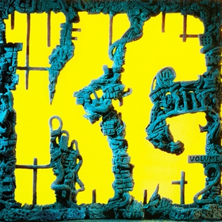

> Galvanising uncertainty  
> Mindful of the weary inkling that is lurking  
> Hierarchy, it's been cracking aegis  
> Embodied in this black heart shameless

Volume 2 of ‘Explorations into Microtonal Tuning’. This is the first of two ‘working from home’ albums developed by sending snippets back and forth online between band members during pandemic lockdown. This process introduced new songwriter combinations that reinvent old ideas and get some new weirder ones out at the same time.

Less sonically focused than ‘Explorations into Microtonal Tuning Vol. 1’, a greater variety of genres and sounds emerge from the originally Anatolian instrument tunings. These include familiar variations on folk and metal, and progress into the earliest experiments with rapping, and Turkish-throwback-synth-disco-pop (yep).

What to listen to next:

*   [If you want Volume 1 of ‘Explorations into Microtonal Tuning’](/gizzverse-guide/fmb)
*   [If you want Volume 3 of ‘Explorations into Microtonal Tuning’ (counterpart to this album)](/gizzverse-guide/lw)
*   [If you want another eclectic mix of genres with some microtonal songs](/gizzverse-guide/gs)
*   [If you like the folk vibes of Honey](/gizzverse-guide/pmdb)
*   [If you like the Metal sound of The Hungry Wolf Of Fate](/gizzverse-guide/itrn)
*   [If you want more vocal rapping like on Oddlife](/gizzverse-guide/og)

* * *

### **L.W., 2021 \[LW\]**

> When the blue sky turns to black  
> When Gaia hangs by a thread  
> When all the people die  
> If not now, then when?

Volume 3 of ‘Explorations into Microtonal Tuning’. This is the second of two ‘working from home’ albums developed by sending snippets back and forth online between band members during pandemic lockdown. Slightly more focused in genre than its counterpart, it embraces its Anatolian roots with a more solid brand of Prog-Rock and of course, strains of funk and metal.

What to listen to next:

  
[If you want Volume 1 of ‘Explorations into Microtonal Tuning’](/gizzverse-guide/fmb)  
[If you want Volume 2 of ‘Explorations into Microtonal Tuning’ (counterpart to this album)](/gizzverse-guide/kg)  
[If you want a full album of heavy songs a bit like K.G.L.W.](/gizzverse-guide/itrn)

* * *

### **Butterfly 3000, 2021 \[BF3K\]**

> Falling upwards through clouds of glue  
> Split dry sky beckons me through  
> A hand outstretched calls my name  
> Time to wake again

The most positive, uplifting album and first to be composed entirely in major scales. The band accompanies programmed synths through a trippy odyssey, looking far into the future and exploring themes of metamorphosis with newfound confidence inspired by fatherhood.

Butterfly 3000 is the first to get a completed accompanying visual album, where each track has a music video. This was attempted for [Nonagon Infinity](/gizzverse-guide/ni), but the project was abandoned by the bands primary visual collaborator Jason Galea in order to keep up with the flurry of albums proceeding that release. This time a diverse spread of friends and new collaborators were commissioned, producing a remarkable body of visual work and appealing to new demographics.

What to listen to next:

*   [If you liked the positive, relaxed atmosphere](/gizzverse-guide/pmdb)
*   [If you want more complex rhythmic interplay between synths and the band](/gizzverse-guide/polygondwanaland)

I’m familiar with the main albums and want to go deeper:

*   [If you want to hear the remix version](/gizzverse-guide/b3001)

* * *

### **Omnium Gatherum, 2022 \[OG\]**

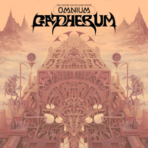

> I am tectonic  
> I am megalithic  
> My spirit runs mauve  
> I am the mountain of which you dream

Omnium Gatherum wraps up the last of the pandemic lockdown-era isolation songs with the results of the first recording sessions with the band all back together jamming in the same room. OG is an eclectic mixture of sounds that blurs the lines between some of their most retrospective sounding songs, and some of their boldest, off-the-wall experimentation.

This blurring is a product of the high volume of live show rehearsals by the band in preparation for their first live performances in two years. The heavily delayed marathon jam shows of March 2020 were originally intended as the ultimate reflection of an already accomplished career, and the fixation on finally fulfilling this goal has seen KGATLW re-emerge as a ‘jam band’. Resulting in an album that feels more complementary to the tours that are now enhanced with extended jam versions of fan favourites, guitar solos, and new songs that can serve as live segues between disconnected older material.

What to listen to next:

*   [If you want the first eclectic concept-less album](/gizzverse-guide/oddments)
*   [If you want another eclectic concept-less album](/gizzverse-guide/gs)
*   [If you liked the heavy songs](/gizzverse-guide/itrn)

I’m familiar with the main albums and want to go deeper:

*   [If you want a playlist of extra long ‘live jam’ songs like The Dripping Tap](https://open.spotify.com/playlist/77cYJha9ttoOpZkZQOCid6?si=28d4f5ace4ed476a) (Spotify link)

* * *

### **Ice, Death, Planets, Lungs, Mushrooms and Lava, 2022 \[IDPLMAL\]**

> Fragmentation  
> New permutations  
> Needlepoint mutilations  
> Stick the fork in the powerpoint to be perturbed by revelations

IDPLMAL is the logical conclusion of a King Gizzard jam album. Each word from the title represents a ‘totem’ chosen by each member of the band; which was then paired with one of the Greek modes, making the only preparation for an extended multi-hour jam that was later trimmed down into each song.

The most collaboratively composed album to date; the band breeze through various ideas, narrowing down on the best by oscillating between simple poetic lyrics and extended instrumental sections to produce one of their trippiest, and surprisingly most consistent records.

What to listen to next:

*   [If you like extended jazzy guitar jamming](/gizzverse-guide/quarters)
*   [If you liked the unusual sound of _Gliese 710_ and want another album in a non-standard mode](/gizzverse-guide/fmb)
*   [If you want more dark, apocalyptic lyrics mismatched with jamming grooves](/gizzverse-guide/fff)

I’m familiar with the main albums and want to go deeper:

*   [If you want a playlist of extra long ‘live jam’ songs](https://open.spotify.com/playlist/77cYJha9ttoOpZkZQOCid6?si=28d4f5ace4ed476a) (Spotify link)

* * *

### **Made In Timeland, 2022 \[MIT\]**

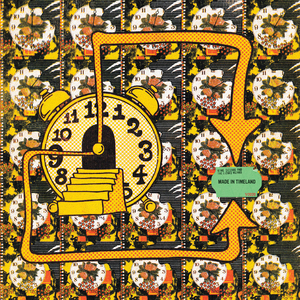

> Smoke and mirrors disappearing when you're near us  
> Uncontactable, retractable

Made in Timeland was cursed. Recorded some time during 2019, it was created as interlude music for the original marathon live shows planned for 2020. The material was shelved, presumably until it would be able to serve its original purpose; but as this prospect dragged out over the course of the pandemic, the band hoped instead to debut it at smaller local shows. Inevitably, these shows would be cancelled too, as the local live music scene struggled to get back on its feet.

The myth of Timeland grew, as hints of its existence from the band grew to outlandish proportions (helped by some uncharacteristic trolling from members of the group) and it’s nature of cursing any show it was meant to be heard at was realised. Was it just an unreleased album? It seemed clear that it wouldn’t sound like a typical release.

Ultimately, some of the shelved vinyl copies meant as a free gift for attendees made it out into the world in early 2022 available in obscure independent record stores, and small allocations available online later on. It eventually received official digital-streaming publication upon completion of the marathon shows it was originally intended for, where its ‘spiritual successor’, Laminated Denim, was used as interlude music instead.

MIT is a deep, trance-like exploration into Techno and IDM production, and oddly contains the first real foray into vocal rapping by ‘Shrimpomaniac’ the alter-ego of Ambrose.

What to listen to next:

*   [If you want to hear the ‘spiritual successor’ to this album](/gizzverse-guide/ld)
*   [If you want an album that has a song that kind of sounds like this (Acarine)](/gizzverse-guide/fff)

* * *

### **Laminated Denim, 2022 \[LD\]**

> Back on track  
> Change the clock through sleight of hand  
> The river has been spanned  
> Behold: the land before Timeland

Touted as the spiritual successor to Made In Timeland, Laminated Denim was the first album to be started and completed after pandemic lockdown ended in Melbourne. Their first jams back in the same room together were so enjoyable that they would base this album and the next ([Ice, Death, Planets, Lungs, Mushrooms And Lava](/gizzverse-guide/idplmal)) on the process.

Though being a guitar-based, chill jam as opposed to the deep techno-IDM journey of its predecessor; the two albums share the disengaged compositional design of interlude music, with tick-tock based polyrhythms and two exactly fifteen minute songs each.

While Made In Timeland was originally intended to serve as the interlude music for the career-defining three hour marathon shows at the legendary Red Rocks Amphitheatre in Colorado, the significant delay of these shows due to the pandemic necessitated this updated version; one song of which was debuted at each of the first two nights, with the album published at the conclusion of the shows — alongside its counterpart, finally breaking the show-delaying curse of Timeland.

What to listen to next:

*   [If you want to hear the ‘spiritual predecessor’ to this album](/gizzverse-guide/mit)
*   [If you want to hear another jam based album with long songs](/gizzverse-guide/idplmal)
*   [If you want more driving bass lines with motorik-style beats](/gizzverse-guide/iiymf)

* * *

### **Changes, 2022 \[CHNGS**\]

> Who should we change for?  
> Who could we be?  
> When my race is done, how did I run?  
> Did I par the course and pass the baton on?

Changes takes the crown for the most time in development. Initially started in 2017, it had been recorded and locked-in as the conclusion of their project to release five albums in that year — but they weren’t fully satisfied. Upon realising that they didn’t yet have the ‘musical vocabulary’ to fully do justice to its concept, it was shelved in favour of [Gumboot Soup](/gizzverse-guide/gs), a concept-less wrap-up for the year’s material.

This dissatisfaction came from a tricky feature of Changes’ composition, based on the key change between D and F#, this is a fiddly transition with few options due to the high degree of separation between keys that are centred a major third apart. Devising several variations on the key change spawned the originally album-length title track, which was later condensed and branched-off, forming a ‘song-cycle’ based on each variation that slowly coming to fruition in spare time over the years.

This may well justify Changes as their most genuine example of Jazz, with the lucid keyboard-focused music partly taking on the ethos of John Coltrane’s _Giant Steps_ to produce a record more firmly set in the genre than past experiments. Though at heart, Changes is still a Pop album, drawing from Funk, Soul, and of course falling back on familiar moments with psych-prog synth and guitar.

Surprisingly, this ‘highly considered’ approach still wound up seeing its conclusion as intended, released as the fifth studio album within a year. Always building momentum, of course something had to be done to out-do 2017’s volume of releases, and so Changes is the fitting end to ‘Gizztober’ as the third album released just within a month, further pushing the boundaries of prolificacy and frequency.

What to listen to next:

*   [If you want another Jazz-based album with groovy bass and keys](/gizzverse-guide/sobe)
*   [If you want more nerdy music theory to unpack](/gizzverse-guide/polygondwanaland)

* * *

Non-Canonical Releases (Work in Progress)
-----------------------------------------

So you’ve heard enough studio albums for the tendrils of the Gizzverse to start creeping through your mind, where do you go next to gain a higher order appreciation of the catalogue? There are in fact several releases that fall outside the primary studio material, but complement it in various ways.

**Willoughby’s Beach, 2011 \[WB\]**

The precursor to debut album [12 Bar Bruise](/gizzverse-guide/12bb), this EP is an even rougher blend of Surf-Punk with little of the psychedelic elements KGATLW would become known for. Named after a beach local to some of the group members, it shows the roots of the group’s formation as an underground party band.

What to listen to next:

*   [If you want to continue with the evolution of the band](/gizzverse-guide/12bb)
*   [If you want to hear more rough early material](/gizzverse-guide/tg)

* * *

### **Butterfly 3001, 2022 \[BF3K1\]**

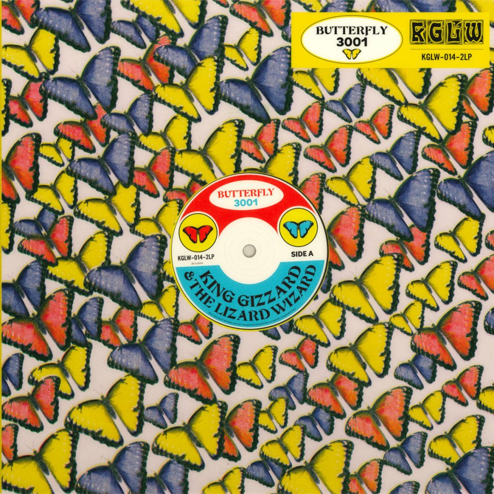

This is a remix album of [Butterfly 3000](/gizzverse-guide/b3000). Stems for the original songs were sent to a diverse set of unlikely collaborators and friends, from Bullant (Joey’s solo project), Confidence Man, Peaches, The Flaming Lips, to the legendary DJ Shadow.

The result is more DJ friendly and perhaps not intended to be listened to all in sequence. At nearly two hours in length each original song is re-interpreted at least once (With five different remixes of Blue Morpho), and bound to contain something for everyone.

What to listen to next:

*   [If you want more electronic KGATLW material](/gizzverse-guide/mit)

* * *

### **Chunky Shrapnel, 2020 \[CS\]**

KGATLW tried to record many live albums over the years, experimenting and waiting until they knew they could go big and get it right the first time. Chunky Shrapnel is the result, chronicling their whole 2019 Europe tour, with highlight moments from each show connected by a few original ‘intermission’ ambient songs.

Though Chunky Shrapnel is more than the album, the tour was captured on analogue film by John Angus Stewart of PHC Films, who had recently become the first visual artist other than Jason Galea to work with the group, producing a set of music videos for [Infest The Rat’s Nest](/gizzverse-guide/itrn). This footage arrived as the concert film of the same title, with the album as a soundtrack to accompany behind the scenes moments as well as the performances.

Other visual work includes Chunky, a high quality photo book shot by Jamie Wdziekonski, a regular photographer of the band with an instantly recognisable grainy black and white style.

Lastly, this tour was the genesis of Jason’s meticulously drawn, limited screen printed posters, now highly collectable, these distinct prints give a unique visual flavour for every show and round out the content of a live album like few others.

What to listen to next:

*   [If you want to hear individual live albums from this tour](/gizzverse-guide/lipar19)

* * *

### **Live in San Francisco ’16, 2020 \[LISF\]**

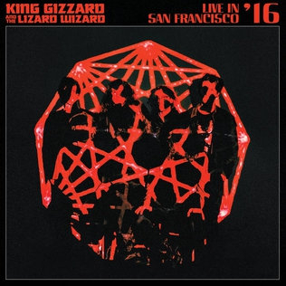

With confidence gained releasing [their first live album](/gizzverse-guide/cs), the band were seemingly ready to revisit a prior recording and finally do it justice in publication. Joining the ranks of Joe Satriani and Thee Oh Sees with a career defining moment captured in (and titled after) the mecca of Psychedelic Rock, this classic style live album predominantly features key tracks from [Nonagon Infinity](/gizzverse-guide/ni), which they were touring in support of, interpolating moments from its predecessor [I’m In Your Mind Fuzz](/gizzverse-guide/iiymf), and culminates in fan favourite jams from [Quarters!](/gizzverse-guide/quarters) and [Float Along — Fill Your Lungs](/gizzverse-guide/fafl); likely the first time these songs were properly captured in extended format for the sake of a live show, now a common practise.

What to listen to next:

*   [If you want to hear another live album with a similar set-list](/gizzverse-guide/lalev16)

* * *

### **Satanic Slumber Party, 2022 \[SSP\]**

During the recording of [Fishing For Fishies](/gizzverse-guide/fff), at inspiration and friend of the band Gareth Liddiard’s rural Victoria home studio, the crew all ended the sessions with a loose, noisy jam. Also known as the Hat Jam (they were all wearing hats), this recording sat dormant and was only hinted at by a snippet in the making-of video: [How to gut a Fishie](https://www.youtube.com/watch?v=CWLhIZpJUAs). Fans wondered for years if the recording would ever see true publication, and after questioning the band about it in a Reddit AMA, it was eventually sanctioned to be fleshed out and completed by Gareth’s project Tropical Fuck Storm and released as a collaboration.

* * *

Official Bootlegger Program (Work In Progress)
----------------------------------------------

Around Christmas time in 2020, the band announced the [Official Bootlegger program](https://kinggizzardandthelizardwizard.com/bootlegger), allowing anyone to produce and distribute their own copies of select KGATLW releases. Based off the experimental release of 2017’s [Polygondwanaland](/gizzverse-guide/polygondwanaland), which is available with a Creative Commons attribution license, the scene that immediately flourished around this album paved the way for a bigger, slightly more thought out scheme.

With the simple condition that if you create a release, you must provide a proportion of copies to the band to sell on [their own platform](https://gizzverse.com/) – fans and labels can now create any edition of compilation and live albums as they see fit. In order to ‘keep it underground’, the band request that these releases are not published on digital streaming platforms, moderation of this policy is lax when it comes to Youtube, where many are posted by the band anyway.

### **Demos Vol. 1 – Music To Kill Bad People To, 2020 \[DV1\]**

A compilation of Demos, released alongside [Vol. 2 – Music To Eat Bananas To](/gizzverse-guide/demos2). Contains early versions of published songs and unnamed/abandoned concepts recorded between 2011-2020. This volume contains early demos of songs from: [Nonagon Infinity](/gizzverse-guide/ni), [Paper Mâché Dream Balloon](/gizzverse-guide/pmdb), [Sketches of Brunswick East](/gizzverse-guide/sobe), [Infest the Rat’s Nest](/gizzverse-guide/itrn), [Fishing For Fishies](/gizzverse-guide/fff), [Gumboot Soup](/gizzverse-guide/gs), [12 Bar Bruise](/gizzverse-guide/12bb), and [K.G.](/gizzverse-guide/kg)

* * *

### **Demos Vol. 2 – Music To Eat Bananas To, 2020 \[DV2\]**

A compilation of Demos, released alongside [Vol. 1 – Music To Kill Bad People To](/gizzverse-guide/demos1). Contains early versions of published songs and unnamed/abandoned concepts recorded between 2011-2020. This volume contains early demos of songs from: [Sketches of Brunswick East](/gizzverse-guide/sobe), [Paper Mâché Dream Balloon](/gizzverse-guide/pmdb), [Willoughby’s Beach](/gizzverse-guide/wb), [Polygondwanaland](/gizzverse-guide/polygondwanaland), [K.G.](/gizzverse-guide/kg), and [Oddments](/gizzverse-guide/oddments).

* * *

### **Demos Vol. 3 – Music To Eat Pond Scum To, 2022 \[DV3\]**

A compilation of Demos, released alongside [Demos Vol. 4 – Music To Die To](/gizzverse-guide/demos4). Contains early versions of published songs and unnamed/abandoned concepts recorded between 2011-2021. This volume contains early demos of songs from: [Butterfly 3000](/gizzverse-guide/b3000), [Gumboot Soup](/gizzverse-guide/gs), [Infest the Rats Nest](/gizzverse-guide/itrn), [K.G.](/gizzverse-guide/kg), and [Omnium Gatherum](/gizzverse-guide/og) and [Willoughby’s Beach](/gizzverse-guide/wb).

* * *

### **Demos Vol. 4 – Music To Die To, 2022 \[DV4\]**

A compilation of Demos, released alongside [Demos Vol. 3 – Music To Eat Pond Scum To](/gizzverse-guide/demos3). Contains early versions of published songs and unnamed/abandoned concepts recorded between 2011-2021. This volume contains early demos of songs from: [Flying Microtonal Banana](/gizzverse-guide/fmb), [Murder of the Universe](/gizzverse-guide/motu), [Fishing For Fishies](/gizzverse-guide/fff), [Omnium Gatherum](/gizzverse-guide/og), and [Nonagon Infinity](/gizzverse-guide/ni).

* * *

### **Teenage Gizzard, 2021 \[TG\]**

Teenage Gizzard is a compilation of the earliest recorded and self published material from the band up until the [Willoughby’s Beach](/gizzverse-guide/wb) EP – sounding similar to that release, the songs are highly characteristic of the era: fast, raw, and simple.

Including the Angelsea EP, the ‘Hey There / Ants & Bats’, and ‘Sleep / Summer’ singles, and other ‘loosies’ such as Trench Foot, originally published in the Anti Fade Records _New Centre Of The Universe Vol. 1_ compilation. Until their publication in the bootlegger program, many of these songs were ‘lost’ and unheard by most fans, existing pretty much only as hand made cassette and CD releases for local distribution; and in some cases had to be ripped back off these releases in the absence of original master recordings.

* * *

### **Live In Paris ’19, 2020 \[LIPAR19\]**

Recorded live at L’Olympia, Paris, France, October 14, 2019, and released in January 2020 during an Australian bush fire crisis, 100% of proceeds from [Bandcamp sales](https://kinggizzard.bandcamp.com/album/live-in-paris-19) are donated to [Wildlife Victoria](https://www.wildlifevictoria.org.au/). The band were promoting [Infest The Rats' Nest](/gizzverse-guide/itrn), and recording material for [Chunky Shrapnel](/gizzverse-guide/cs) through this tour – but leading up to the original planned marathon jam shows of 2020 the set-lists tended to be notably diverse, including throwbacks, rarities and alternate versions of fan favourites. For this performance, these include: Crumbling Castle and The Fourth Colour ([Polygondwanaland](/gizzverse-guide/polygondwanaland)), Muddy Water ([Gumboot Soup](/gizzverse-guide/gs)) and an extended jam version of Am I In Heaven? ([I’m In Your Mind Fuzz](/gizzverse-guide/iiymf)).

What to listen to next:

*   [If you want to hear the live album compiled from this whole tour](/gizzverse-guide/cs)
*   [If you want to hear another full show from this tour](/gizzverse-guide/libru19)

* * *

### **Live In Adelaide ’19, 2020 \[LIADE19\]**

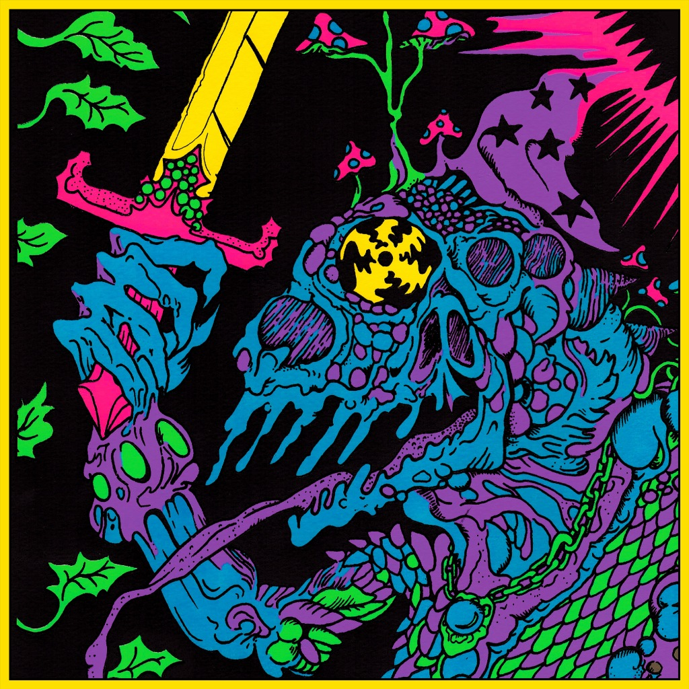

Recorded live at Thebarton Theatre, Tarntanya (Adelaide), Australia, July 12th 2019, and released in January 2020 during an Australian bush fire crisis, 100% of proceeds from [Bandcamp sales](https://kinggizzard.bandcamp.com/album/live-in-adelaide-19) are donated to [Animals Australia](https://animalsaustralia.org/). The set-list consists mostly of [Infest The Rats Nest](/gizzverse-guide/itrn), which would release about a month later, and [Fishing For Fishies](/gizzverse-guide/fff), the newest album at the time. Other notable songs include the Inner Cell trilogy ([Polygondwanaland](/gizzverse-guide/polygondwanaland)), and a nearly half hour jam of Head On/Pill ([Float Along — Fill Your Lungs](/gizzverse-guide/fafl)) that features Adam Halliwell of Mildlife (tour opening act) on flute.

What to listen to next:

*   [If you want to hear the shows from the Europe leg of this ‘pre-tour’](/gizzverse-guide/lipar19)

* * *

### **Live In Brussels ’19, 2020 \[LIBRU19\]**

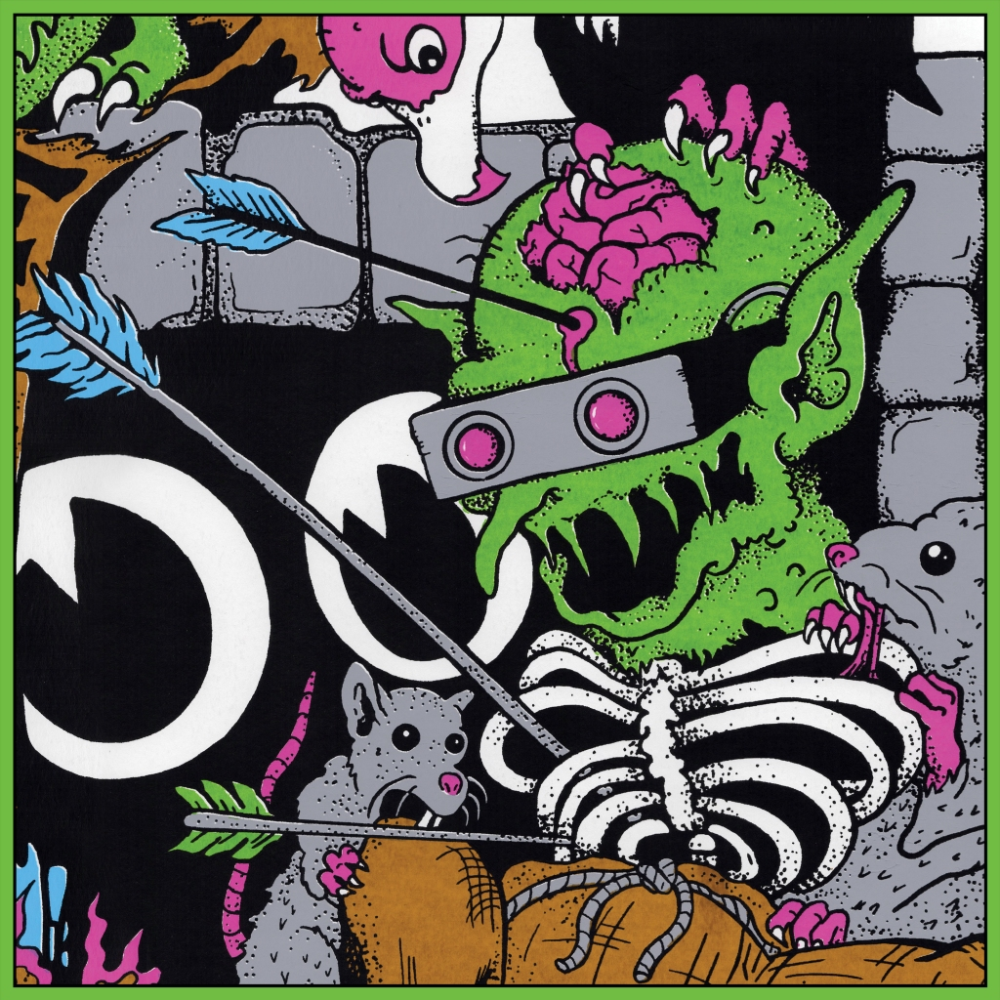

Recorded live at Ancienne Belgique, Brussels, Belgium, October 8th and 9th 2019, and released in January 2020 during an Australian bush fire crisis, 100% of proceeds from [Bandcamp sales](https://kinggizzard.bandcamp.com/album/live-in-brussels-19) are donated to [Wires wildlife Rescue](https://www.wires.org.au/). The band were promoting [Infest The Rats Nest](/gizzverse-guide/itrn), and recording material for [Chunky Shrapnel](/gizzverse-guide/cs) through this tour – but leading up to the original planned marathon jam shows of 2020 the set-lists tended to be notably diverse, including throwbacks, rarities and alternate versions of fan favourites. For this performance, these include: Sense ([Paper Mâché Dream Balloon](/gizzverse-guide/pmdb)), The Wheel and Down The Sink with very rare vocals from Cook ([Gumboot Soup](/gizzverse-guide/gs)), and Work This Time ([Oddments](/gizzverse-guide/oddments)).

What to listen to next:

*   [If you want to hear the live album compiled from this whole tour](/gizzverse-guide/cs)
*   [If you want to hear another full show from this tour](/gizzverse-guide/lipar19)

* * *

### **Live In Asheville ’19, 2020 \[LIASH19\]**

Recorded live at New Belgium Brewing Company, Asheville, NC, USA, September 1st 2019, and released October 1st 2020. The band were promoting [Infest The Rats Nest](/gizzverse-guide/itrn), and recording material for [Chunky Shrapnel](/gizzverse-guide/cs) through this tour – but leading up to the original planned marathon jam shows of 2020 the set-lists tended to be notably diverse, including throwbacks, rarities and alternate versions of fan favourites. For this performance, these include: Alter Me III and Altered Beast IV ([Murder Of The Universe](/gizzverse-guide/motu)), Beginner’s Luck ([Gumboot Soup](/gizzverse-guide/gs)), and a 13+ minute finale of The Bitter Boogie ([Paper Mâché Dream Balloon](/gizzverse-guide/pmdb)).

What to listen to next:

*   [If you want to hear the live album compiled from this whole tour](/gizzverse-guide/cs)
*   [If you want to hear another unique set-list from this tour](/gizzverse-guide/libru19)

* * *

### **Live In London ’19, 2020 \[LILON19\]**

Recorded live at Alexandra Palace, London, England, October 5th 2019 and released December 24th 2020, the 10,000 capacity venue hosted KGATLW’s biggest ever live show at the time. The band were promoting [Infest The Rats Nest](/gizzverse-guide/itrn), and recording material for [Chunky Shrapnel](/gizzverse-guide/cs) through this tour, the set-list for this landmark show is full of heavy staples and concludes with a shortened 10 minute version of Float Along — Fill Your Lungs ([Float Along — Fill Your Lungs](/gizzverse-guide/fafl)). Compared with the other 2019 live albums it has notably higher audio quality with well mixed crowd sounds.

What to listen to next:

*   [If you want to hear the live album compiled from this whole tour](/gizzverse-guide/cs)
*   [If you want to hear another full show from this tour](/gizzverse-guide/liash19)

* * *

### **Live In Melbourne ’21, 2021 \[LIMEL21\]**

Recorded live at Summer Sound Festival, Sidney Myer Music Bowl, Naarm (Melbourne), Australia, February 26, 2021 and released March 19th 2021, this release was also made [available on Youtube](https://www.youtube.com/watch?v=8X_LVeLFrA8) by the band with concert footage. Opening with a rare solo drumming track titled ‘Fury’, the performance occurred between the releases of companion albums [K.G.](/gizzverse-guide/kg) and [L.W.](/gizzverse-guide/lw) with both heavily featured. Several live staples from [Flying Microtonal Banana](/gizzverse-guide/fmb) are also included to round out this entirely microtonal set-list.

What to listen to next:

*   [If you want to hear another entirely microtonal live album](/gizzverse-guide/lisyd21)

* * *

### **Live In Sydney ’21, 2021 \[LISYD21\]**

Recorded live at The Enmore Theatre, Cadigal country (Sydney), Australia, April 22nd 2021 and released May 29, 2021, this release was also made [available on Youtube](https://www.youtube.com/watch?v=JbjZ-jZnoss) by the band with concert footage. The performance occurred shortly after the release of [L.W.](/gizzverse-guide/lw) and has an entirely microtonal set-list comprised with the other two volumes of that series and some rarities from [Sketches Of Brunswick East](/gizzverse-guide/sobe).

What to listen to next:

*   [If you want to hear another entirely microtonal live album](/gizzverse-guide/limel21)

* * *

### **Live In Milwaukee ’19, 2021 \[LIMIL19\]**

Recorded live at Riverside Theatre, Milwaukee, WI, USA, August 23rd 2019 and released October 1, 2021. The band were promoting [Infest The Rats Nest](/gizzverse-guide/itrn), and recording material for [Chunky Shrapnel](/gizzverse-guide/cs) through this tour – but leading up to the original planned marathon jam shows of 2020 the set-lists tended to be notably diverse, including throwbacks, rarities and alternate versions of fan favourites. For this performance, these include: Stressin’ ([Oddments](/gizzverse-guide/oddments)), Down The Sink with very rare vocals from Cook ([Gumboot Soup](/gizzverse-guide/gs)), Acarine ([Fishing For Fishies](/gizzverse-guide/fff)), and concluding with the longest version of Head On – Pill to date, at just over 30 minutes ([Float Along — Fill Your Lungs](/gizzverse-guide/fafl)).

What to listen to next:

*   [If you want to hear the live album compiled from this whole tour](/gizzverse-guide/cs)
*   [If you want to hear another full show from this tour](/gizzverse-guide/lilon19)

* * *

### **Live In Brisbane ’21, 2022 \[LIBRI22\]**

Recorded live at The Princess Theatre, Meeanjin (Brisbane), December 19th 2021 and released January 27, 2022. Each track from this release was uploaded to Youtube by the band, [here](https://www.youtube.com/playlist?list=PLjcIIEsozEvCSBYMVnGZsEbm31JfsKc2r) is a correctly sequenced playlist. This tour consisted of five night residencies in Melbourne, Sydney, Perth, Hobart, and Adelaide, with Brisbane to be the final stop. The set-list for each night had a different theme, which for this recording (night one) was ‘Acoustic’. ‘Jams’, ‘Microtonal’, ‘Garage’, and ‘Metal’ were the four other themes.

Courtesy of the theme, the set-list contains a selection too unique to give highlights – consisting of their chillest and grooviest songs, the vibes are high and the toned down, ‘unplugged’ style instrument suite gives these songs rare justice after years of frenetic live shows.

What to listen to next:

*   [If you want to hear another themed live set-list](/gizzverse-guide/limel21)

* * *

### **Live At Levitation ’14, 2021 \[LALEV14\]**

Recorded live at Carson Creek Ranch, Austin, Texas, USA, May 2nd 2014 and released December 10, 2021. This was the first full live show that KGATLW played in the United States, at the psychedelic rock festival Levitation.

Promoting [I’m In Your Mind Fuzz](/gizzverse-guide/iiymf) at the time, the set list consists mostly of that album, including the rare b-side _Wholly Ghost_ (this is the only digital publication of that song), and concluding with Head On – Pill ([Float Along — Fill Your Lungs](/gizzverse-guide/fafl)).

What to listen to next:

*   [If you want to hear another music festival set](/gizzverse-guide/labon22)
*   [If you want to hear their next visit to Levitation](/gizzverse-guide/lalev16)

* * *

### **Live At Levitation ’16, 2021 \[LALEV16\]**

Recorded live at Carson Creek Ranch, Austin, Texas, USA, May 1st 2016 and released December 10, 2021, this is the return of KGATLW to psychedelic rock festival Levitation. They were building up to the release of [Nonagon Infinity](/gizzverse-guide/ni) at the time, playing songs from that album mixed with its predecessor [I’m In Your Mind Fuzz](/gizzverse-guide/iiymf), featuring live staple The River ([Quarters!](/gizzverse-guide/quarters)) and concluding with a rare version of Cut Throat Boogie ([12 Bar Bruise](/gizzverse-guide/12bb))

What to listen to next:

*   [If you want to hear their previous visit to Levitation](/gizzverse-guide/lalev14)

* * *

### **Live At Bonnaroo ’22, 2022 \[LABON22\]**

Recorded live at Bonnaroo, Great Stage Park, Manchester, TN, USA, 17th June 2022, and released August 2022. This set contains staples from [Nonagon Infinity](/gizzverse-guide/ni), [Infest The Rats Nest](/gizzverse-guide/itrn) and [I’m In Your Mind Fuzz](/gizzverse-guide/iiymf), mixed with choices from the newly released [Omnium Gatherum](/gizzverse-guide/og) (including rare live vocals from Cook for his track, The Garden Goblin). The bootlegger package includes the professionally shot concert footage from the festival stream.

What to listen to next:

*   [If you want to hear another music festival set](/gizzverse-guide/lalev14)

* * *

Solo/Related Projects (Work In Progress)
----------------------------------------

