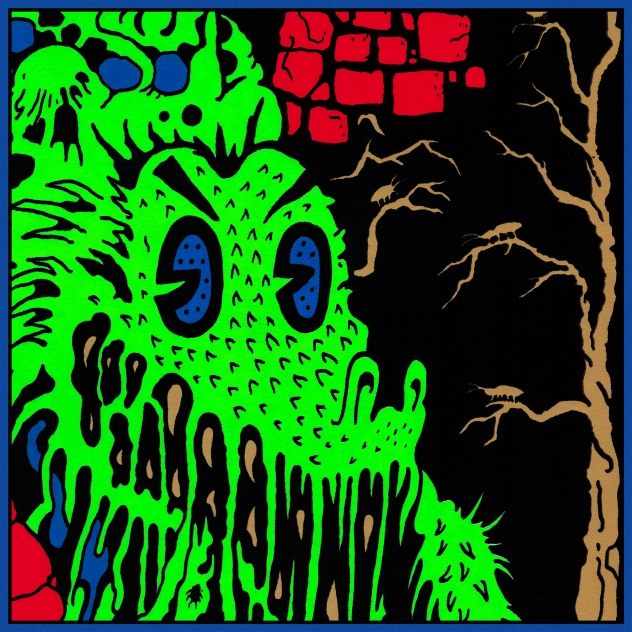
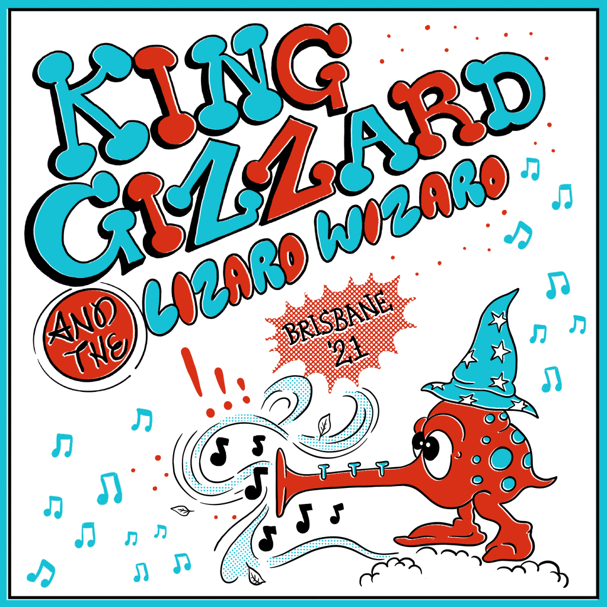

+++
title = "The Gizzverse Guide"
author = "@BoilerRhapsody"
+++

How do you get into King Gizzard and the Lizard Wizard? Many hear a small sample of this incredible band, but are immediately turned off when faced with what to listen to next out of such a high volume of material.

Welcome to the Gizzverse Guide, a catalogue of KGATLW releases, each with an introductory blurb that establishes its significance within the overall discography. Each entry is linked by attributes that you can use to take you to the next listening suggestion, based on what you already know or like about the music.

**What To Do:**

*   If you have already heard an album and don’t know where to go from there, navigate to it from the contents list below then follow the prompts (The back button will take you back to the previous album).
*   If you are completely new to the band, have heard nothing and don’t know where to start, check out some of the strategies below.

**Essentials**

While always debatable, there is a path of ‘essential’ albums that most efficiently shows the core sounds and material that the fan base grew around. For the purposes of this guide, I consider [I’m in Your Mind Fuzz](/releases/im-in-your-mind-fuzz) to be the first essential listen. These albums are thereafter referred to as the ‘Gizzverse albums’ in the prompts through the guide.

**Chronological**

Listening through a discography chronologically is the tried and true way of getting into a band, as it is the way that fans who have followed a band get to experience each album as well. While the sheer volume of albums may feel daunting, they evolve through so many sounds and levels of polish so quickly that if you aren’t liking an album by about the third song, just skip to the next release for something different nearly every time.

Their first album is [12 Bar Bruise]; but if you have heard of the band by some of their newest material, then perhaps starting at the [current newest album](/releases/changes) and listening in reverse chronological order may work better for you.

**Vibe**

Pick an album by title and cover. Each record has a distinct personality that is well conveyed in its title and artwork. [Murder of the Universe](/releases/murder-of-the-universe) is as dark and despondent as it looks and sounds, [Paper Mâché Dream Balloon](/releases/paper-mache-dream-balloon) as whimsical as the scene on the front, so pick one that jumps out at you.

**Visuals**

If something isn’t quite ‘clicking’, try some of the visual work as well. [The video for Rattlesnake](https://youtu.be/Q-i1XZc8ZwA) is what instantly made me a fan after years of the band just being a funny name on the radio with an occasional stand out track. [Nonagon Infinity](/releases/nonagon-infinity) and [Butterfly 3000](/releases/butterfly-3000) are albums with lots of high quality visual work behind them.

The band have many great videos all available on their [Youtube Channel](https://www.youtube.com/playlist?list=PLjEpdah_kOgfhdncO5YfjdQY9hFzPq-2r).

**Playlists**

You don’t need to experience each album all the way through right away. [Some](/releases/gumboot-soup) don’t have overarching concepts, and many are split into shorter suites or medleys. Some songs from different releases even belong together. [Murder of the Nonagon Fuzz](https://www.youtube.com/watch?v=0rXwufFoJYw) (re-upload) is an impressive fan made album mashup that uses only songs with accompanying music videos, seamlessly connecting five different projects.

Here are some playlist links:

*   [Enter the Gizzverse](https://open.spotify.com/playlist/5BCrVQWTTeoKAvV9GaHmu0?si=1a3f541197c54722) (Spotify)
*   [Heavy songs](https://open.spotify.com/playlist/7BfZwU7yVZrmX9XmwkJbaJ?si=54b411c741d24f7f) (Spotify)
*   [Long songs](https://open.spotify.com/playlist/77cYJha9ttoOpZkZQOCid6?si=950dd84376a14818) (Spotify)
*   [King Gizzard & the Lizard Wizard – Live In Brisbane ’21](https://www.youtube.com/playlist?list=PLjcIIEsozEvCSBYMVnGZsEbm31JfsKc2r) (Acoustic live set not available on DSPs)
*   [King Gizzard & The Lizard Wizard – Gizzverse Odyssey](https://www.youtube.com/watch?v=3KIlzA7QO4I&list=WL&index=2&t=13s) (Digital only Official Bootlegger comp.)

**Criticism**

While music critics and fan bases always clash, due credit for [Pitchfork](https://pitchfork.com/artists/32633-king-gizzard-the-lizard-wizard/) and Anthony Fantano at [The Needle Drop](https://www.youtube.com/playlist?list=PLW8qY_BtlPqcMWd3nn8E8p3rm3YlcFV0d) for (mostly) giving KGATLW a fair shot.

I also have a couple of KGATLW album reviews published on the blog: [Murder of the Universe](https://boilerrhapsody.com/2018/05/29/album-review-king-gizzard-the-lizard-wizard-murder-of-the-universe/), and [Fishing For Fishies](https://boilerrhapsody.com/2022/03/06/album-review-king-gizzard-and-the-lizard-wizard-fishing-for-fishies/).

**Live Material**

We are currently in a renaissance of KGATLW live performance. The band was just really starting to settle in as a ‘jam band’ with emphasis on their live show elevated to more than just promotion of their studio releases, when the COVID-19 pandemic paused live music touring for two years. Their several live in-studio performances at KEXP are known for drawing in fans:

*   [2015 – im-in-your-mind-fuzz/QRTRS](https://www.youtube.com/watch?v=4W19twyYD2Q)
*   [2017 – flying-microtonal-banana](https://www.youtube.com/watch?v=Qxxz7Tgfsv4)
*   [2018 – murder-of-the-universe (Live with crowd)](https://www.youtube.com/watch?v=G5Z4bma_tUM)
*   [2018 – POLY/gumboot-soup](https://www.youtube.com/watch?v=wxwu7FYFSek&t=1510s)
*   [2019 – infest-the-rats-nest](https://www.youtube.com/watch?v=EnmFKS2eDBA)

However, there are many publications of KGATLW live material out there, from [fan made crowd recordings](https://www.youtube.com/channel/UC_nJOSthA7oUlizlfO3tmEg), ‘official bootlegger‘ band sanctioned soundboard recordings published by fans, and label published traditional [live show recordings](/releases/chunky-shrapnel).

**Other Guides**

I am not the first or the last to create a dedicated guide for getting into KGATLW.

Album flowcharts are common in the fan base (and served as inspiration behind many of the connections in this guide). Though clunky to use and constantly out of date, the idea retains an attractive simplicity. [Here is the most common one](https://www.reddit.com/r/KGATLW/comments/lysvvz/i_finally_updated_my_king_gizzard_flowchart_now/), and some others: [2](https://www.reddit.com/r/KGATLW/comments/uhyne5/my_take_on_the_king_gizzard_flowchart/), [3](https://www.reddit.com/r/KGATLW/comments/j2xore/nonagon_flowchart/), [4](https://www.reddit.com/r/KGATLW/comments/a2su97/flowchart_i_made_for_a_friend_wanting_to_get_into/), [5](https://www.reddit.com/r/KGATLW/comments/d4n8sa/i_made_a_venn_diagram_of_their_albums/).

[https://get-into-gizz.com](https://get-into-gizz.com/) is a similar, simpler, more streamlined equivalent to this guide.

Ball State Daily’s [Choose your own adventure discography guide](https://www.ballstatedaily.com/byte/article/2021/02/choose-your-own-discography-guide-king-gizzard-the-lizard-wizard), is also similar to this guide, but out of date and not interactive.

Contents
--------

*   [Band Biography](/bio)
*   [Releases: Official & Bootlegger](/releases)
*   **Related Projects** — So you’ve completed the KGATLW catalogue and don’t know where to go next? Between band member side projects, past iterations, and a wide spread of collaborators and friends, there is a much bigger world waiting your discovery.
    *   [The Murlocs](/the-murlocs)
    *   Bullant
    *   Mild High Club
    *   Tropical Fuck Storm
    *   Jason Galea (visual artist)

* * *

### **Demos Vol. 2 – Music To Eat Bananas To, 2020 \[demos-vol-2-music-to-eat-bananas-to\]**

A compilation of Demos, released alongside [Vol. 1 – Music To Kill Bad People To](/releases/demos1). Contains early versions of published songs and unnamed/abandoned concepts recorded between 2011-2020. This volume contains early demos of songs from: [Sketches of Brunswick East](/releases/sketches-of-brunswick-east), [Paper Mâché Dream Balloon](/releases/paper-mache-dream-balloon), [Willoughby’s Beach](/releases/willoughbys-beach), [Polygondwanaland](/releases/polygondwanaland), [K.G.](/releases/kg), and [Oddments](/releases/oddments).

* * *

### **Demos Vol. 3 – Music To Eat Pond Scum To, 2022 \[demos-vol-3-music-to-eat-pond-scum-to\]**

A compilation of Demos, released alongside [Demos Vol. 4 – Music To Die To](/releases/demos4). Contains early versions of published songs and unnamed/abandoned concepts recorded between 2011-2021. This volume contains early demos of songs from: [Butterfly 3000](/releases/butterfly-3000), [Gumboot Soup](/releases/gumboot-soup), [Infest the Rats Nest](/releases/infest-the-rats-nest), [K.G.](/releases/kg), and [Omnium Gatherum](/releases/omnium-gatherium) and [Willoughby’s Beach](/releases/willoughbys-beach).

* * *

### **Demos Vol. 4 – Music To Die To, 2022 \[demos-vol-4-music-to-die-to\]**

A compilation of Demos, released alongside [Demos Vol. 3 – Music To Eat Pond Scum To](/releases/demos3). Contains early versions of published songs and unnamed/abandoned concepts recorded between 2011-2021. This volume contains early demos of songs from: [Flying Microtonal Banana](/releases/flying-microtonal-banana), [Murder of the Universe](/releases/murder-of-the-universe), [Fishing For Fishies](/releases/fishing-for-fishies), [Omnium Gatherum](/releases/omnium-gatherium), and [Nonagon Infinity](/releases/nonagon-infinity).

* * *

### **Teenage Gizzard, 2021 \[teenage-gizzard\]**

Teenage Gizzard is a compilation of the earliest recorded and self published material from the band up until the [Willoughby’s Beach](/releases/willoughbys-beach) EP – sounding similar to that release, the songs are highly characteristic of the era: fast, raw, and simple.

Including the Angelsea EP, the ‘Hey There / Ants & Bats’, and ‘Sleep / Summer’ singles, and other ‘loosies’ such as Trench Foot, originally published in the Anti Fade Records _New Centre Of The Universe Vol. 1_ compilation. Until their publication in the bootlegger program, many of these songs were ‘lost’ and unheard by most fans, existing pretty much only as hand made cassette and CD releases for local distribution; and in some cases had to be ripped back off these releases in the absence of original master recordings.

* * *

### **Live In Paris ’19, 2020 \[live-in-paris-2019\]**

Recorded live at L’Olympia, Paris, France, October 14, 2019, and released in January 2020 during an Australian bush fire crisis, 100% of proceeds from [Bandcamp sales](https://kinggizzard.bandcamp.com/album/live-in-paris-19) are donated to [Wildlife Victoria](https://www.wildlifevictoria.org.au/). The band were promoting [Infest The Rats' Nest](/releases/infest-the-rats-nest), and recording material for [Chunky Shrapnel](/releases/chunky-shrapnel) through this tour – but leading up to the original planned marathon jam shows of 2020 the set-lists tended to be notably diverse, including throwbacks, rarities and alternate versions of fan favourites. For this performance, these include: Crumbling Castle and The Fourth Colour ([Polygondwanaland](/releases/polygondwanaland)), Muddy Water ([Gumboot Soup](/releases/gumboot-soup)) and an extended jam version of Am I In Heaven? ([I’m In Your Mind Fuzz](/releases/im-in-your-mind-fuzz)).

What to listen to next:

*   [If you want to hear the live album compiled from this whole tour](/releases/chunky-shrapnel)
*   [If you want to hear another full show from this tour](/releases/live-in-brussels-2019)

* * *

### **Live In Adelaide ’19, 2020 \[live-in-adelaide-2019\]**

Recorded live at Thebarton Theatre, Tarntanya (Adelaide), Australia, July 12th 2019, and released in January 2020 during an Australian bush fire crisis, 100% of proceeds from [Bandcamp sales](https://kinggizzard.bandcamp.com/album/live-in-adelaide-19) are donated to [Animals Australia](https://animalsaustralia.org/). The set-list consists mostly of [Infest The Rats Nest](/releases/infest-the-rats-nest), which would release about a month later, and [Fishing For Fishies](/releases/fishing-for-fishies), the newest album at the time. Other notable songs include the Inner Cell trilogy ([Polygondwanaland](/releases/polygondwanaland)), and a nearly half hour jam of Head On/Pill ([Float Along — Fill Your Lungs](/releases/float-along-fill-your-lungs)) that features Adam Halliwell of Mildlife (tour opening act) on flute.

What to listen to next:

*   [If you want to hear the shows from the Europe leg of this ‘pre-tour’](/releases/live-in-paris-2019)

* * *

### **Live In Brussels ’19, 2020 \[live-in-brussels-2019\]**

Recorded live at Ancienne Belgique, Brussels, Belgium, October 8th and 9th 2019, and released in January 2020 during an Australian bush fire crisis, 100% of proceeds from [Bandcamp sales](https://kinggizzard.bandcamp.com/album/live-in-brussels-19) are donated to [Wires wildlife Rescue](https://www.wires.org.au/). The band were promoting [Infest The Rats Nest](/releases/infest-the-rats-nest), and recording material for [Chunky Shrapnel](/releases/chunky-shrapnel) through this tour – but leading up to the original planned marathon jam shows of 2020 the set-lists tended to be notably diverse, including throwbacks, rarities and alternate versions of fan favourites. For this performance, these include: Sense ([Paper Mâché Dream Balloon](/releases/paper-mache-dream-balloon)), The Wheel and Down The Sink with very rare vocals from Cook ([Gumboot Soup](/releases/gumboot-soup)), and Work This Time ([Oddments](/releases/oddments)).

What to listen to next:

*   [If you want to hear the live album compiled from this whole tour](/releases/chunky-shrapnel)
*   [If you want to hear another full show from this tour](/releases/live-in-paris-2019)

* * *

### **Live In Asheville ’19, 2020 \[live-in-asheville-2019\]**

Recorded live at New Belgium Brewing Company, Asheville, NC, USA, September 1st 2019, and released October 1st 2020. The band were promoting [Infest The Rats Nest](/releases/infest-the-rats-nest), and recording material for [Chunky Shrapnel](/releases/chunky-shrapnel) through this tour – but leading up to the original planned marathon jam shows of 2020 the set-lists tended to be notably diverse, including throwbacks, rarities and alternate versions of fan favourites. For this performance, these include: Alter Me III and Altered Beast IV ([Murder Of The Universe](/releases/murder-of-the-universe)), Beginner’s Luck ([Gumboot Soup](/releases/gumboot-soup)), and a 13+ minute finale of The Bitter Boogie ([Paper Mâché Dream Balloon](/releases/paper-mache-dream-balloon)).

What to listen to next:

*   [If you want to hear the live album compiled from this whole tour](/releases/chunky-shrapnel)
*   [If you want to hear another unique set-list from this tour](/releases/live-in-brussels-2019)

* * *

### **Live In London ’19, 2020 \[live-in-london-2019\]**

Recorded live at Alexandra Palace, London, England, October 5th 2019 and released December 24th 2020, the 10,000 capacity venue hosted KGATLW’s biggest ever live show at the time. The band were promoting [Infest The Rats Nest](/releases/infest-the-rats-nest), and recording material for [Chunky Shrapnel](/releases/chunky-shrapnel) through this tour, the set-list for this landmark show is full of heavy staples and concludes with a shortened 10 minute version of Float Along — Fill Your Lungs ([Float Along — Fill Your Lungs](/releases/float-along-fill-your-lungs)). Compared with the other 2019 live albums it has notably higher audio quality with well mixed crowd sounds.

What to listen to next:

*   [If you want to hear the live album compiled from this whole tour](/releases/chunky-shrapnel)
*   [If you want to hear another full show from this tour](/releases/live-in-asheville-2019)

* * *

### **Live In Melbourne ’21, 2021 \[live-in-melbourne-2019\]**

Recorded live at Summer Sound Festival, Sidney Myer Music Bowl, Naarm (Melbourne), Australia, February 26, 2021 and released March 19th 2021, this release was also made [available on Youtube](https://www.youtube.com/watch?v=8X_LVeLFrA8) by the band with concert footage. Opening with a rare solo drumming track titled ‘Fury’, the performance occurred between the releases of companion albums [K.G.](/releases/kg) and [L.W.](/releases/lw) with both heavily featured. Several live staples from [Flying Microtonal Banana](/releases/flying-microtonal-banana) are also included to round out this entirely microtonal set-list.

What to listen to next:

*   [If you want to hear another entirely microtonal live album](/releases/live-in-sydney-2021)

* * *

### **Live In Sydney ’21, 2021 \[live-in-sydney-2021\]**

Recorded live at The Enmore Theatre, Cadigal country (Sydney), Australia, April 22nd 2021 and released May 29, 2021, this release was also made [available on Youtube](https://www.youtube.com/watch?v=JbjZ-jZnoss) by the band with concert footage. The performance occurred shortly after the release of [L.W.](/releases/lw) and has an entirely microtonal set-list comprised with the other two volumes of that series and some rarities from [Sketches Of Brunswick East](/releases/sketches-of-brunswick-east).

What to listen to next:

*   [If you want to hear another entirely microtonal live album](/releases/live-in-melbourne-2019)

* * *

### **Live In Milwaukee ’19, 2021 \[live-in-milwaukee-2019\]**

Recorded live at Riverside Theatre, Milwaukee, WI, USA, August 23rd 2019 and released October 1, 2021. The band were promoting [Infest The Rats Nest](/releases/infest-the-rats-nest), and recording material for [Chunky Shrapnel](/releases/chunky-shrapnel) through this tour – but leading up to the original planned marathon jam shows of 2020 the set-lists tended to be notably diverse, including throwbacks, rarities and alternate versions of fan favourites. For this performance, these include: Stressin’ ([Oddments](/releases/oddments)), Down The Sink with very rare vocals from Cook ([Gumboot Soup](/releases/gumboot-soup)), Acarine ([Fishing For Fishies](/releases/fishing-for-fishies)), and concluding with the longest version of Head On – Pill to date, at just over 30 minutes ([Float Along — Fill Your Lungs](/releases/float-along-fill-your-lungs)).

What to listen to next:

*   [If you want to hear the live album compiled from this whole tour](/releases/chunky-shrapnel)
*   [If you want to hear another full show from this tour](/releases/live-in-london-2019)

* * *

### **Live In Brisbane ’21, 2022 \[live-in-brisbane-2022\]**

Recorded live at The Princess Theatre, Meeanjin (Brisbane), December 19th 2021 and released January 27, 2022. Each track from this release was uploaded to Youtube by the band, [here](https://www.youtube.com/playlist?list=PLjcIIEsozEvCSBYMVnGZsEbm31JfsKc2r) is a correctly sequenced playlist. This tour consisted of five night residencies in Melbourne, Sydney, Perth, Hobart, and Adelaide, with Brisbane to be the final stop. The set-list for each night had a different theme, which for this recording (night one) was ‘Acoustic’. ‘Jams’, ‘Microtonal’, ‘Garage’, and ‘Metal’ were the four other themes.

Courtesy of the theme, the set-list contains a selection too unique to give highlights – consisting of their chillest and grooviest songs, the vibes are high and the toned down, ‘unplugged’ style instrument suite gives these songs rare justice after years of frenetic live shows.

What to listen to next:

*   [If you want to hear another themed live set-list](/releases/live-in-melbourne-2019)

* * *

### **Live At Levitation ’14, 2021 \[live-at-levitation-2014\]**

Recorded live at Carson Creek Ranch, Austin, Texas, USA, May 2nd 2014 and released December 10, 2021. This was the first full live show that KGATLW played in the United States, at the psychedelic rock festival Levitation.

Promoting [I’m In Your Mind Fuzz](/releases/im-in-your-mind-fuzz) at the time, the set list consists mostly of that album, including the rare b-side _Wholly Ghost_ (this is the only digital publication of that song), and concluding with Head On – Pill ([Float Along — Fill Your Lungs](/releases/float-along-fill-your-lungs)).

What to listen to next:

*   [If you want to hear another music festival set](/releases/live-at-bonnaroo-2022)
*   [If you want to hear their next visit to Levitation](/releases/live-at-levitation-2016)

* * *

### **Live At Levitation ’16, 2021 \[live-at-levitation-2016\]**

Recorded live at Carson Creek Ranch, Austin, Texas, USA, May 1st 2016 and released December 10, 2021, this is the return of KGATLW to psychedelic rock festival Levitation. They were building up to the release of [Nonagon Infinity](/releases/nonagon-infinity) at the time, playing songs from that album mixed with its predecessor [I’m In Your Mind Fuzz](/releases/im-in-your-mind-fuzz), featuring live staple The River ([Quarters!](/releases/quarters)) and concluding with a rare version of Cut Throat Boogie ([12 Bar Bruise](/releases/12-bar-bruise))

What to listen to next:

*   [If you want to hear their previous visit to Levitation](/releases/live-at-levitation-2014)

* * *

### **Live At Bonnaroo ’22, 2022 \[live-at-bonnaroo-2022\]**

Recorded live at Bonnaroo, Great Stage Park, Manchester, TN, USA, 17th June 2022, and released August 2022. This set contains staples from [Nonagon Infinity](/releases/nonagon-infinity), [Infest The Rats Nest](/releases/infest-the-rats-nest) and [I’m In Your Mind Fuzz](/releases/im-in-your-mind-fuzz), mixed with choices from the newly released [Omnium Gatherum](/releases/omnium-gatherium) (including rare live vocals from Cook for his track, The Garden Goblin). The bootlegger package includes the professionally shot concert footage from the festival stream.

What to listen to next:

*   [If you want to hear another music festival set](/releases/live-at-levitation-2014)

* * *

Solo/Related Projects (Work In Progress)
----------------------------------------

[12 Bar Bruise]: /releases/12-bar-bruise
