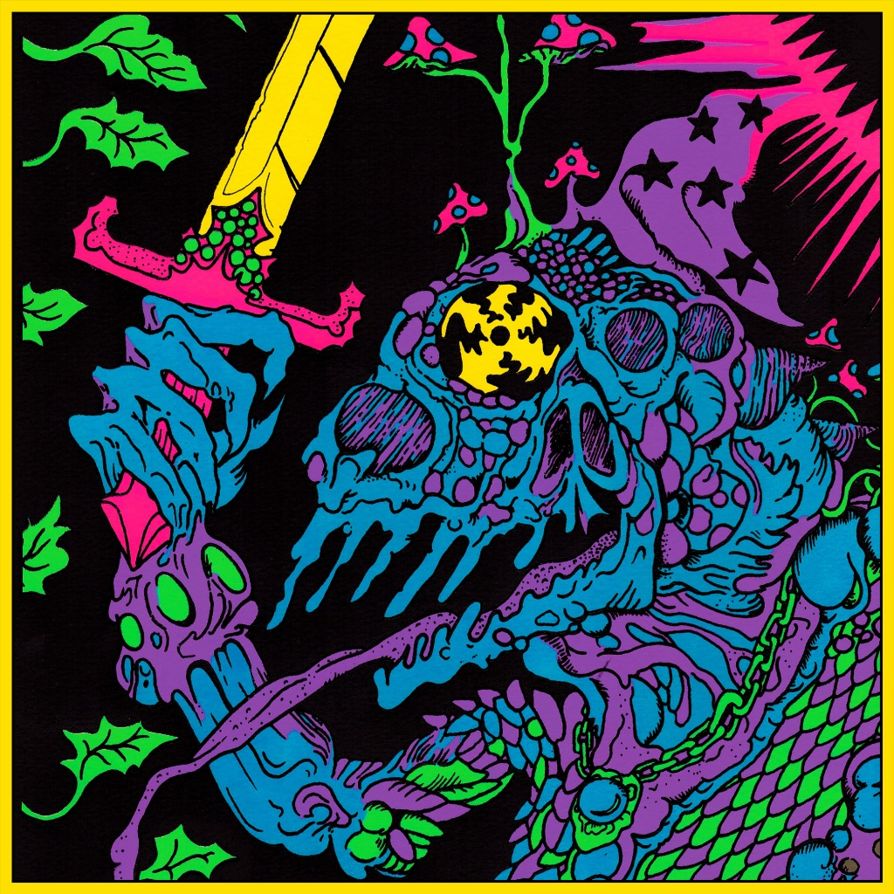

+++
title = "Live In Adelaide ’19 (2020)"
+++

Recorded live at Thebarton Theatre, Tarntanya (Adelaide), Australia, July 12th 2019, and released in January 2020 during an Australian bush fire crisis, 100% of proceeds from [Bandcamp sales](https://kinggizzard.bandcamp.com/album/live-in-adelaide-19) are donated to [Animals Australia](https://animalsaustralia.org/). The set-list consists mostly of [Infest The Rats Nest](../infest-the-rats-nest), which would release about a month later, and [Fishing For Fishies](../fishing-for-fishies), the newest album at the time. Other notable songs include the Inner Cell trilogy ([Polygondwanaland](../polygondwanaland)), and a nearly half hour jam of Head On/Pill ([Float Along — Fill Your Lungs](../float-along-fill-your-lungs)) that features Adam Halliwell of Mildlife (tour opening act) on flute.

What to listen to next:

*   [If you want to hear the shows from the Europe leg of this ‘pre-tour’](../live-in-paris-2019)
