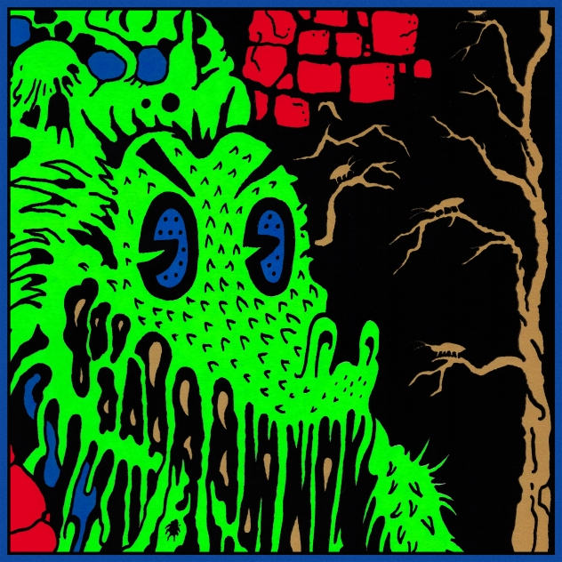

+++
title = "Live In Asheville ’19 (2020)"
+++

Recorded live at New Belgium Brewing Company, Asheville, NC, USA, September 1st 2019, and released October 1st 2020. The band were promoting [Infest The Rats Nest](./infest-the-rats-nest), and recording material for [Chunky Shrapnel](./chunky-shrapnel) through this tour – but leading up to the original planned marathon jam shows of 2020 the set-lists tended to be notably diverse, including throwbacks, rarities and alternate versions of fan favourites. For this performance, these include: Alter Me III and Altered Beast IV ([Murder Of The Universe](./murder-of-the-universe)), Beginner’s Luck ([Gumboot Soup](./gumboot-soup)), and a 13+ minute finale of The Bitter Boogie ([Paper Mâché Dream Balloon](./paper-mache-dream-balloon)).

What to listen to next:

*   [If you want to hear the live album compiled from this whole tour](./chunky-shrapnel)
*   [If you want to hear another unique set-list from this tour](./live-in-brussels-2019)
