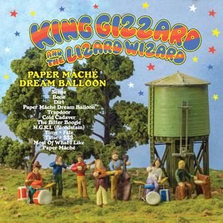

+++
title = "Paper Mâché Dream Balloon (2015)"
+++

> But in fact it's a pattern  
> Everything I hear will always make me ashen  
> I know it's recognizable  
> But it don't make no sense at all, oh

This refreshing psych-pop album was recorded almost entirely on acoustic instruments for a quaint, folk-pop effect. The lyrics provide a dark undertone hinting at stories that highly contrast the sound. Showcases the Clarinet as part of a project to learn a new instrument every year.

What to listen to next:

*   [If you liked the brighter, positive sound](./butterfly-3000)
*   [If you want another Pop-based album](./changes)
*   [If you more relaxed 60s style](./float-along-fill-your-lungs)
*   [If you want a different ‘period’ sound](./fishing-for-fishies)
*   [If you prefer the tone of the music to match very dark, intense lyrics](./infest-the-rats-nest)

I’m familiar with the main albums and want to go deeper:

*   [If the guy who sings The Bitter Boogie sounds cool and you want to hear more](./the-murlocs)
