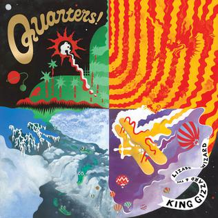

+++
title = "Quarters! (2015)"
+++

> Once you're in the zone  
> The river flows down like a full stone  
> Water is your bed  
> The ripples cushion your head

This slow, chill, Jazz-Rock album consists of four jams with a duration of 10 minutes and 10 seconds each. It is best known for fan-favourite track ‘The River’, that interpolates Dave Brubeck’s standard Take Five, establishing a fascination with time signatures that use odd numbers of beats.

What to listen to next:

*   [If you want a stronger jazz influence](/releases/sketches-of-brunswick-east)
*   [If you don’t mind long songs with stoner vibes](/releases/float-along-fill-your-lungs)
*   [If you want more loose, jazzy guitar jamming](/releases/ice-death-planets-lungs-mushrooms-and-lava)

I’m familiar with the main albums and want to go deeper:

*   [If you want a playlist of just long songs](https://open.spotify.com/playlist/77cYJha9ttoOpZkZQOCid6?si=28d4f5ace4ed476a) (Spotify link)
