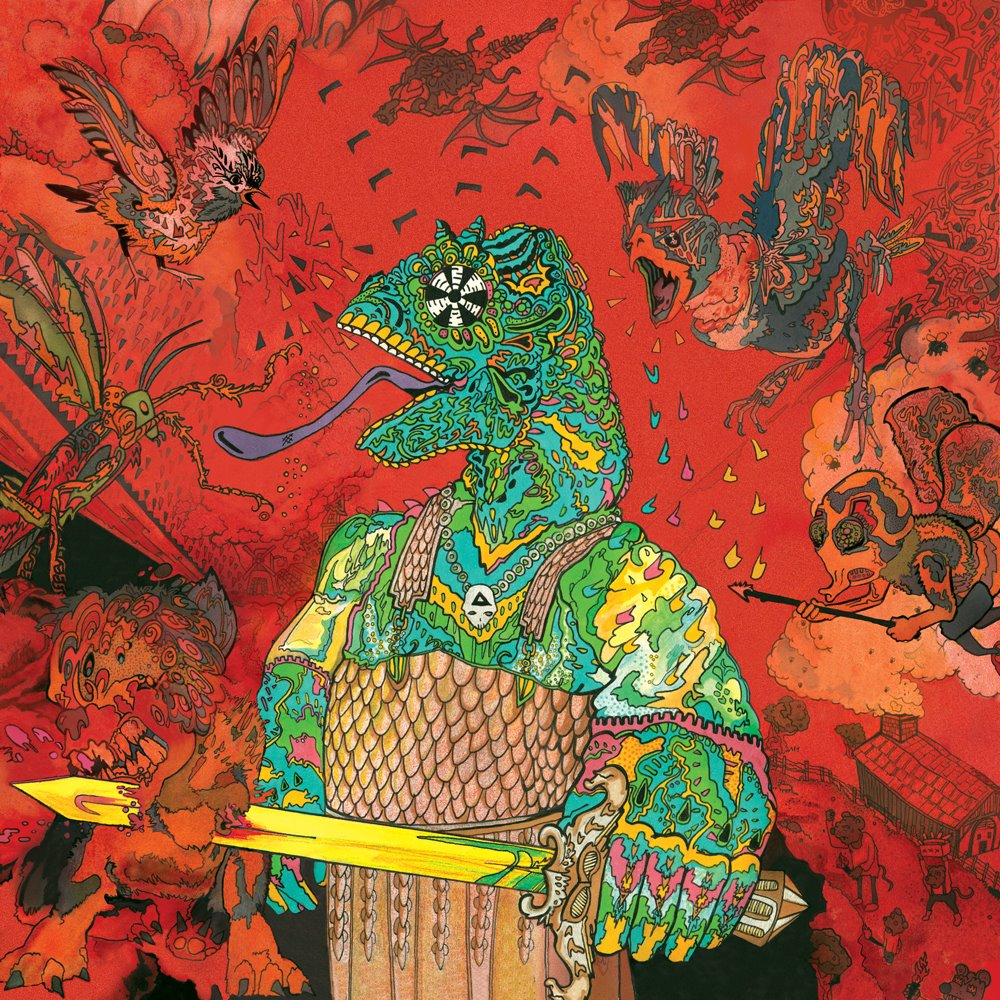

> Well I ain’t dumb  
> But I ain’t that smart  
> And I can’t spell  
> But I can sound it out

The debut album. Surfy, lo-fi, and slightly trippy Garage Rock. This album was partially recorded on iPhones and serves as means to an end, delineating all looser prior material and establishing KGATLW as a fully functioning band.

Distribution necessitated the founding of Flightless Records, the independent label that published all the work of the group for nearly a decade.

The album cover was the first by Jason Galea, now considered a member of the group, who as well as creating most of the other visual work of the band, has designed every cover since.

What to listen to next:

*   [If you want a step up from the (literal) tin shed garage style production quality](../im-in-your-mind-fuzz)
*   [If you liked the narrated track, Sam Cherry’s Last Shot](../eyes-like-the-sky)

I’m familiar with the main albums and want to go deeper:

*   [If you want more like Cut Throat Boogie](../../the-murlocs)
