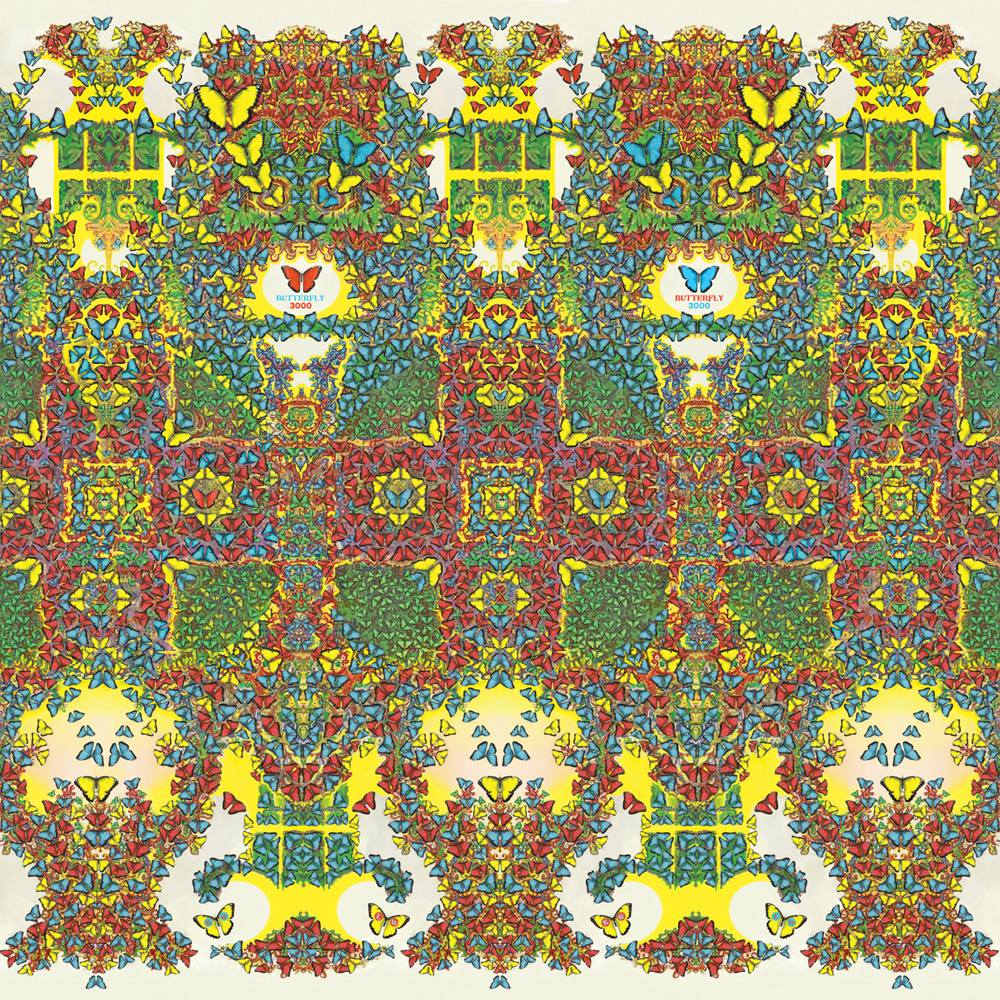

> Falling upwards through clouds of glue  
> Split dry sky beckons me through  
> A hand outstretched calls my name  
> Time to wake again

Release Date: 11 June 2021

The most positive, uplifting album and first to be composed entirely in major scales. The band accompanies programmed synths through a trippy odyssey, looking far into the future and exploring themes of metamorphosis with newfound confidence inspired by fatherhood.

Butterfly 3000 is the first to get a completed accompanying visual album, where each track has a music video. This was attempted for [Nonagon Infinity](../nonagon-infinity), but the project was abandoned by the bands primary visual collaborator Jason Galea in order to keep up with the flurry of albums proceeding that release. This time a diverse spread of friends and new collaborators were commissioned, producing a remarkable body of visual work and appealing to new demographics.

What to listen to next:

*   [If you liked the positive, relaxed atmosphere](../paper-mache-dream-balloon)
*   [If you want more complex rhythmic interplay between synths and the band](../polygondwanaland)

I’m familiar with the main albums and want to go deeper:

*   [If you want to hear the remix version](../butterfly-3001)
