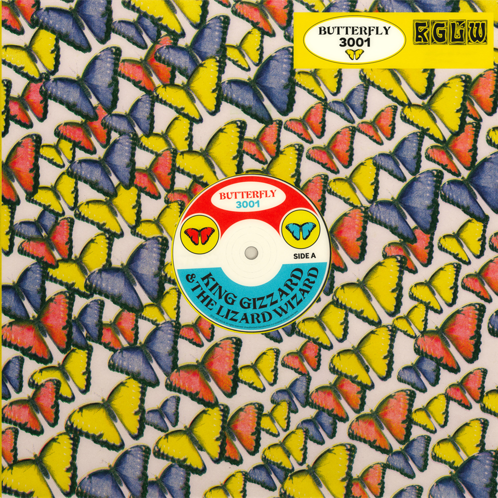

This is a remix album of [Butterfly 3000](../butterfly-3000). Stems for the original songs were sent to a diverse set of unlikely collaborators and friends, from Bullant (Joey’s solo project), Confidence Man, Peaches, The Flaming Lips, to the legendary DJ Shadow.

The result is more DJ friendly and perhaps not intended to be listened to all in sequence. At nearly two hours in length each original song is re-interpreted at least once (With five different remixes of Blue Morpho), and bound to contain something for everyone.

What to listen to next:

*   [If you want more electronic KGATLW material](../made-in-timeland)
