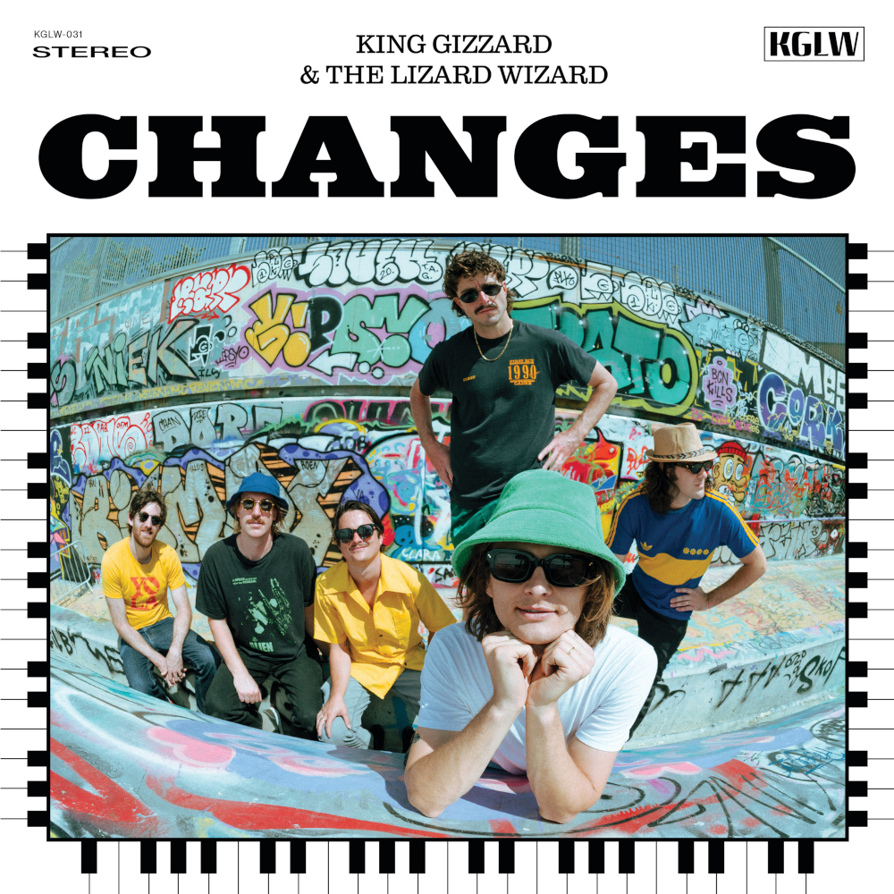

> Who should we change for?  
> Who could we be?  
> When my race is done, how did I run?  
> Did I par the course and pass the baton on?

Release Date: 28 October 2022

Changes takes the crown for the most time in development. Initially started in 2017, it had been recorded and locked-in as the conclusion of their project to release five albums in that year — but they weren’t fully satisfied. Upon realising that they didn’t yet have the ‘musical vocabulary’ to fully do justice to its concept, it was shelved in favour of [Gumboot Soup](../gumboot-soup), a concept-less wrap-up for the year’s material.

This dissatisfaction came from a tricky feature of Changes’ composition, based on the key change between D and F#, this is a fiddly transition with few options due to the high degree of separation between keys that are centred a major third apart. Devising several variations on the key change spawned the originally album-length title track, which was later condensed and branched-off, forming a ‘song-cycle’ based on each variation that slowly coming to fruition in spare time over the years.

This may well justify Changes as their most genuine example of Jazz, with the lucid keyboard-focused music partly taking on the ethos of John Coltrane’s _Giant Steps_ to produce a record more firmly set in the genre than past experiments. Though at heart, Changes is still a Pop album, drawing from Funk, Soul, and of course falling back on familiar moments with psych-prog synth and guitar.

Surprisingly, this ‘highly considered’ approach still wound up seeing its conclusion as intended, released as the fifth studio album within a year. Always building momentum, of course something had to be done to out-do 2017’s volume of releases, and so Changes is the fitting end to ‘Gizztober’ as the third album released just within a month, further pushing the boundaries of prolificacy and frequency.

What to listen to next:

*   [If you want another Jazz-based album with groovy bass and keys](../sketches-of-brunswick-east)
*   [If you want more nerdy music theory to unpack](../polygondwanaland)
