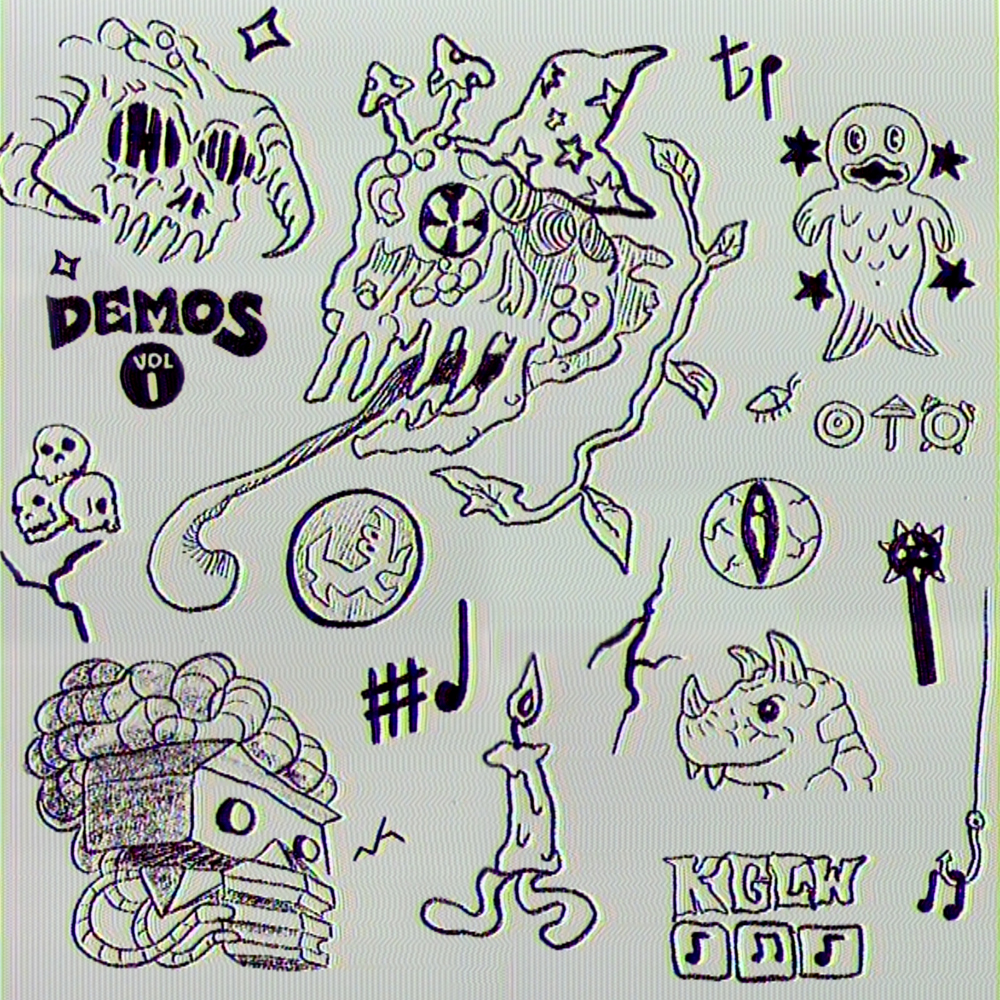

A compilation of Demos, released alongside [Vol. 2 – Music To Eat Bananas To](../demos-vol-2-music-to-eat-bananas-to). Contains early versions of published songs and unnamed/abandoned concepts recorded between 2011-2020. This volume contains early demos of songs from: [Nonagon Infinity](../nonagon-infinity), [Paper Mâché Dream Balloon](../paper-mache-dream-balloon), [Sketches of Brunswick East](../sketches-of-brunswick-east), [Infest the Rat’s Nest](../infest-the-rats-nest), [Fishing For Fishies](../fishing-for-fishies), [Gumboot Soup](../gumboot-soup), [12 Bar Bruise](../12-bar-bruise), and [K.G.](../kg)
