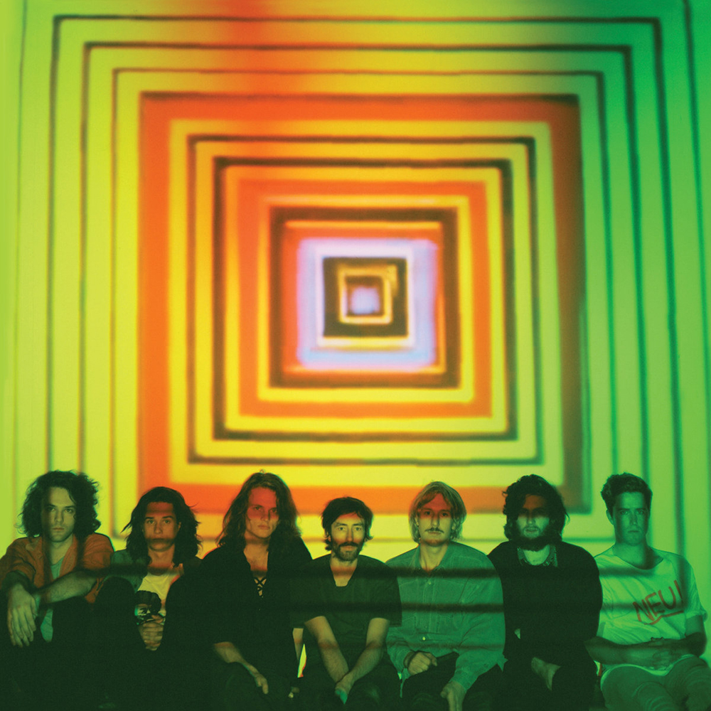

> Just yesterday, I sat across from my legs  
> They weren't connected to me  
> And I couldn't see 'cause my eyes weren't in me  
> Hold me up straight while I screw my head on

The first true psychedelic album. A lo-fi throwback in sound to The Beatles’ Indian influenced era, thanks to the extensive use of a Sitar. This instrument was chosen as the first in a project to learn a new instrument every year, also marking the beginning of a discography wide fascination with sounds from ‘the East’.

What to listen to next:

*   [If you want an album of long, trippy jams](../quarters)
*   [If you want more of the ‘Eastern’ sound](../flying-microtonal-banana)
*   [If you want more of the chill 60s Psych-Pop vibe](../paper-mache-dream-balloon)
*   [If you want a bit more Rock in your Psych-Rock](../im-in-your-mind-fuzz)
