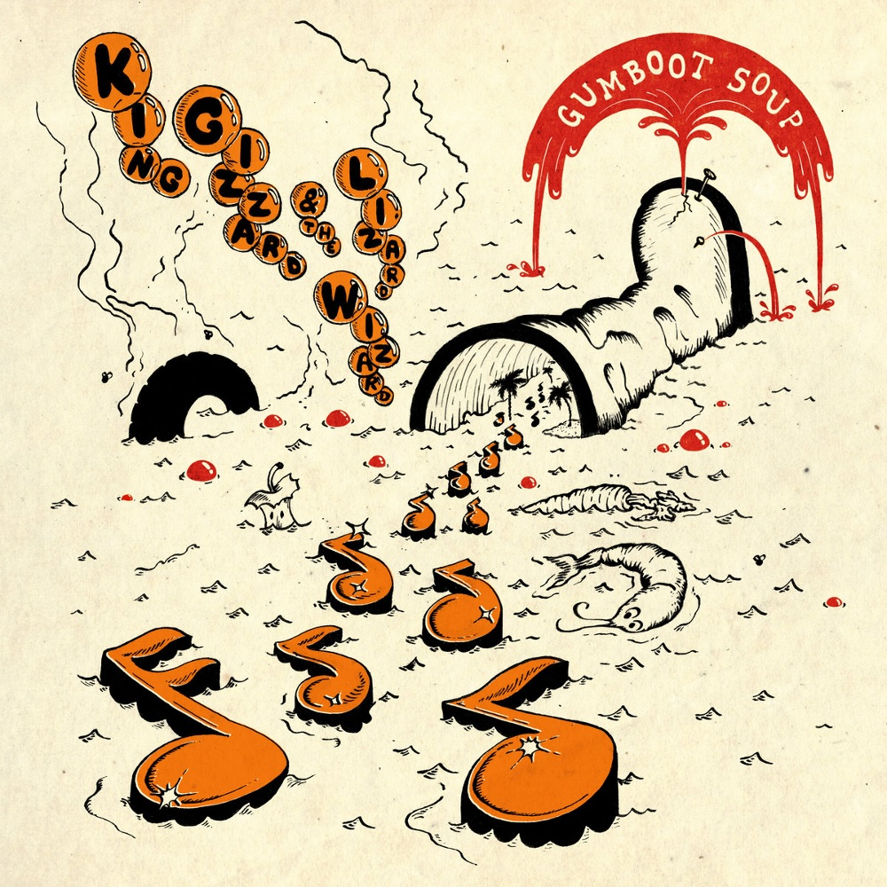

> Our minds unpack, muscles relax  
> We are superfluous, and in a stupor  
> We only fall asleep willingly  
> At the wheel that steers us into our future

Release Date: 29 December 2017.

After four studio albums and two international tours in 2017 alone, one would think KGATLW were done for the year. With one more promised, something had to be done with all the extra material that either didn’t fit on, or was developed separate from the first four of the year. Gumboot Soup is an eclectic mix of songs; some exist ‘between’ albums with the concept of one and the sound of another, others simply too good to rot in the vault waiting for a future project to fit into. Don’t be fooled into thinking of these as B-sides. Gumboot Soup is the high quality culmination of the insane project to release five studio albums in one calendar year, arriving just in time in the last days of December.

What to listen to next:

*   [If you want an earlier lo-fi eclectic concept-less album](../oddments)
*   [If you want the newest eclectic concept-less album](../omnium-gatherium) <!-- TODO revisit "newest" 😄  -->
*   [If you want an album full of heavy songs like ‘The Great Chain of Being’](../infest-the-rats-nest)
*   [If you want to hear the album ‘Superposition’ didn’t quite fit into](../polygondwanaland)
*   [If you want to hear the album ‘All Is Known’ would’ve been](../nonagon-infinity) on if it wasn’t made during [this one](../flying-microtonal-banana)
*   [If you liked the laid-back Pop sounds of 'Beginner’s Luck', 'I’m Sleepin’ In', and 'The Wheel'](../changes)

I’m familiar with the main albums and want to go deeper:

*   [If you want to hear more songs that lend a ‘peak behind the curtain’ of the creative process](../demos-vol-1-music-to-kill-bad-people-to)
