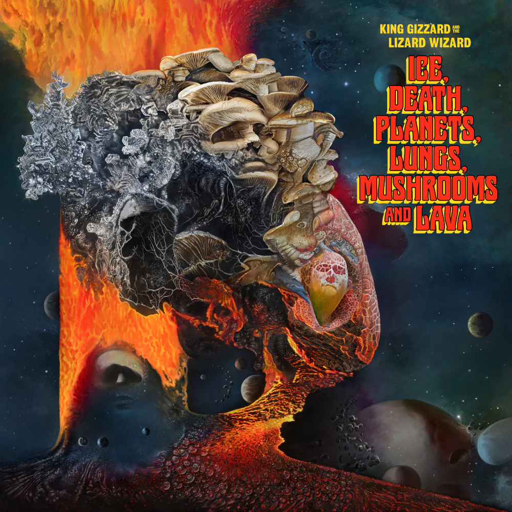

> Fragmentation  
> New permutations  
> Needlepoint mutilations  
> Stick the fork in the powerpoint to be perturbed by revelations

Release Date: 7 October 2022.

Ice, Death, Planets, Lungs, Mushrooms, And Lava is the logical conclusion of a King Gizzard jam album. Each word from the title represents a ‘totem’ chosen by each member of the band; which was then paired with one of the Greek modes, making the only preparation for an extended multi-hour jam that was later trimmed down into each song.

The most collaboratively composed album to date, the band breeze through various ideas, narrowing down on the best by oscillating between simple poetic lyrics and extended instrumental sections to produce one of their trippiest, and surprisingly most consistent records.

What to listen to next:

*   [If you like extended jazzy guitar jamming](../quarters)
*   [If you liked the unusual sound of 'Gliese 710' and want another album in a non-standard mode](../flying-microtonal-banana)
*   [If you want more dark, apocalyptic lyrics mismatched with jamming grooves](../fishing-for-fishies)
