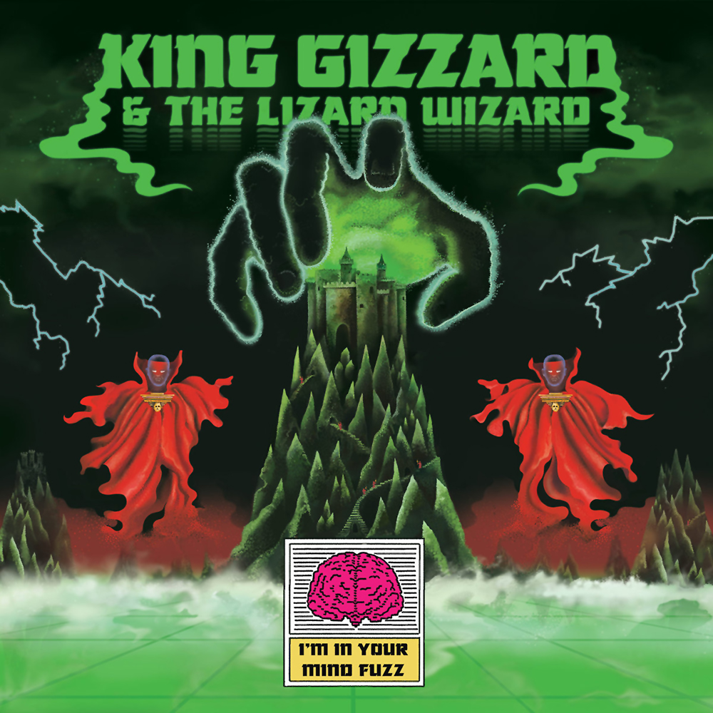

> When I’m in your mind  
> Then I’m in your mind  
> When I’m in your mind fuzz  
> Then I'm in your mind

With a clean Krautrock inspired foundation, KGATLW make their first big evolution with a pivot away from lo-fi production. im-in-your-mind-fuzz moves more confidently between driving and relaxed psychedelic sounds, and features the Flute as part of a project to learn a new instrument every year. The first album recorded in a professional studio, the first published internationally, and the first truly essential, realised, KGATLW album.

Traditionally recommended as the best starting point of the discography, it implements several ideas that would eventually coalesce into what is now known as the ‘Gizzverse’. These include visual elements of the album artwork and music videos, and seamless track medleys that link songwriting elements — Both aspects lay significant groundwork for imagery and concepts that are built upon in later albums.

What to listen to next:

*   [If you want the next ‘essential’ Gizzverse album](../nonagon-infinity)
*   [If you liked the driving basslines of Krautrock influence](../flying-microtonal-banana)
*   [If you prefer a minimal studio mix for a cleaner sound](../polygondwanaland)
*   [If you like the ‘slow jam’ tracks](../quarters)
