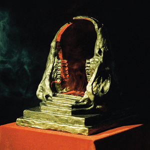

> Open your eyes and light the fluid  
> Get into it, petrol siphon  
> Low on meals, browning fields  
> Bury children

Release Date: 16 August 2019

This is the searing culmination after years of fan speculation if KGATLW would ever produce a pure-blooded Metal album. Thrash was the perfect experiment for each member to push their technical abilities further, with some familiar undertones of nerdy Stoner-Metal and classic Hard-Rock.

With a Satanic environmental apocalypse narrative – this is the mission that jettisoned the Gizzverse away from a decayed, spent Earth.

What to listen to next:

*   [If you liked the heaviness and don’t mind getting weirder](../murder-of-the-universe)
*   [If you want the same amount of energy and less heaviness is okay](../nonagon-infinity)
*   [If you've heard enough of the Gizzverse and want something different and down to Earth](../changes)
