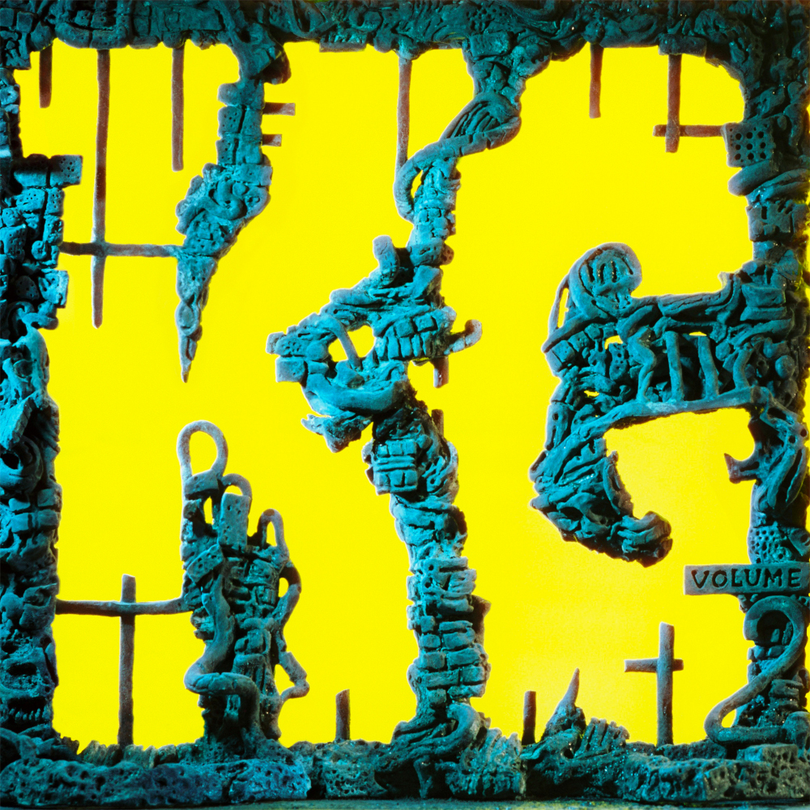

> Galvanising uncertainty  
> Mindful of the weary inkling that is lurking  
> Hierarchy, it's been cracking aegis  
> Embodied in this black heart shameless

Volume 2 of ‘Explorations into Microtonal Tuning’. This is the first of two ‘working from home’ albums developed by sending snippets back and forth online between band members during pandemic lockdown. This process introduced new songwriter combinations that reinvent old ideas and get some new weirder ones out at the same time.

Less sonically focused than ‘Explorations into Microtonal Tuning Vol. 1’, a greater variety of genres and sounds emerge from the originally Anatolian instrument tunings. These include familar variations on folk and metal; but also explore new experiments with rapping and Turkish-throwback-synth-disco-pop (yep).

What to listen to next:

*   [If you want Volume 1 of ‘Explorations into Microtonal Tuning’](../flying-microtonal-banana)
*   [If you want Volume 3 of ‘Explorations into Microtonal Tuning’ (counterpart to this album)](../lw)
*   [If you want another eclectic mix of genres with some microtonal songs](../gumboot-soup)
*   [If you like the folk vibes of 'Honey'](../paper-mache-dream-balloon)
*   [If you like the Metal sound of 'The Hungry Wolf Of Fate'](../infest-the-rats-nest)
*   [If you want more vocal rapping like on 'Oddlife'](../omnium-gatherium)
