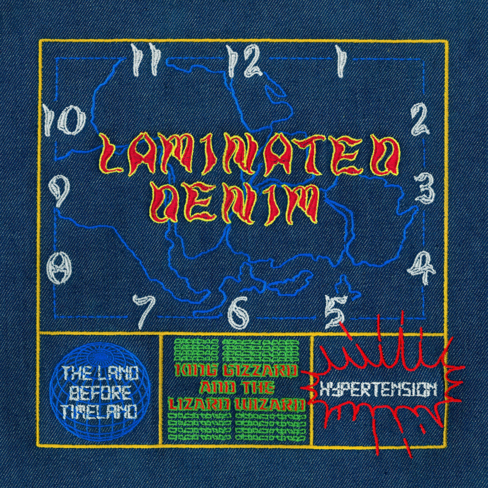

> Back on track  
> Change the clock through sleight of hand  
> The river has been spanned  
> Behold: the land before Timeland

Touted as the spiritual successor to Made In Timeland, Laminated Denim was the first album to be started and completed after pandemic lockdown ended in Melbourne. Their first jams back in the same room together were so enjoyable that they would base this album and the next ([Ice, Death, Planets, Lungs, Mushrooms And Lava](../ice-death-planets-lungs-mushrooms-and-lava)) on the process.

Though being a guitar-based, chill jam as opposed to the deep techno-IDM journey of its predecessor; the two albums share the disengaged compositional design of interlude music, with tick-tock based polyrhythms and two exactly fifteen minute songs each.

While Made In Timeland was originally intended to serve as the interlude music for the career-defining three hour marathon shows at the legendary Red Rocks Amphitheatre in Colorado, the significant delay of these shows due to the pandemic necessitated this updated version; one song of which was debuted at each of the first two nights, with the album published at the conclusion of the shows — alongside its counterpart, finally breaking the show-delaying curse of Timeland.

What to listen to next:

*   [If you want to hear the ‘spiritual predecessor’ to this album](../made-in-timeland)
*   [If you want to hear another jam based album with long songs](../ice-death-planets-lungs-mushrooms-and-lava)
*   [If you want more driving bass lines with motorik-style beats](../im-in-your-mind-fuzz)
