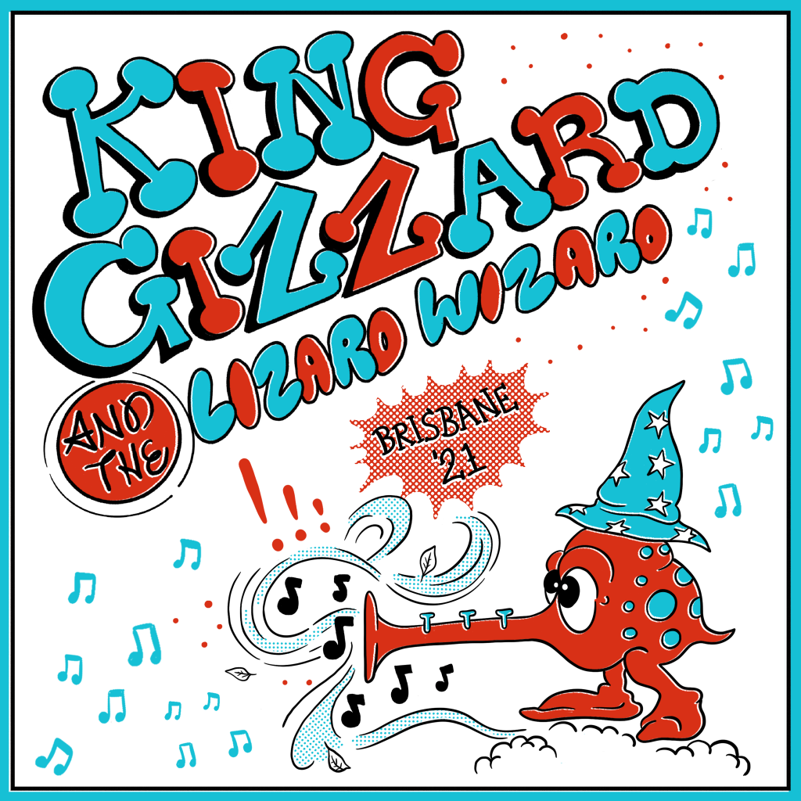

Recorded live at The Princess Theatre, Meeanjin (Brisbane), December 19th 2021 and released January 27, 2022. Each track from this release was uploaded to Youtube by the band, [here](https://www.youtube.com/playlist?list=PLjcIIEsozEvCSBYMVnGZsEbm31JfsKc2r) is a correctly sequenced playlist. This tour consisted of five night residencies in Melbourne, Sydney, Perth, Hobart, and Adelaide, with Brisbane to be the final stop. The set-list for each night had a different theme, which for this recording (night one) was ‘Acoustic’. ‘Jams’, ‘Microtonal’, ‘Garage’, and ‘Metal’ were the four other themes.

Courtesy of the theme, the set-list contains a selection too unique to give highlights – consisting of their chillest and grooviest songs, the vibes are high and the toned down, ‘unplugged’ style instrument suite gives these songs rare justice after years of frenetic live shows.

What to listen to next:

*   [If you want to hear another themed live set-list](../live-in-melbourne-2021)
