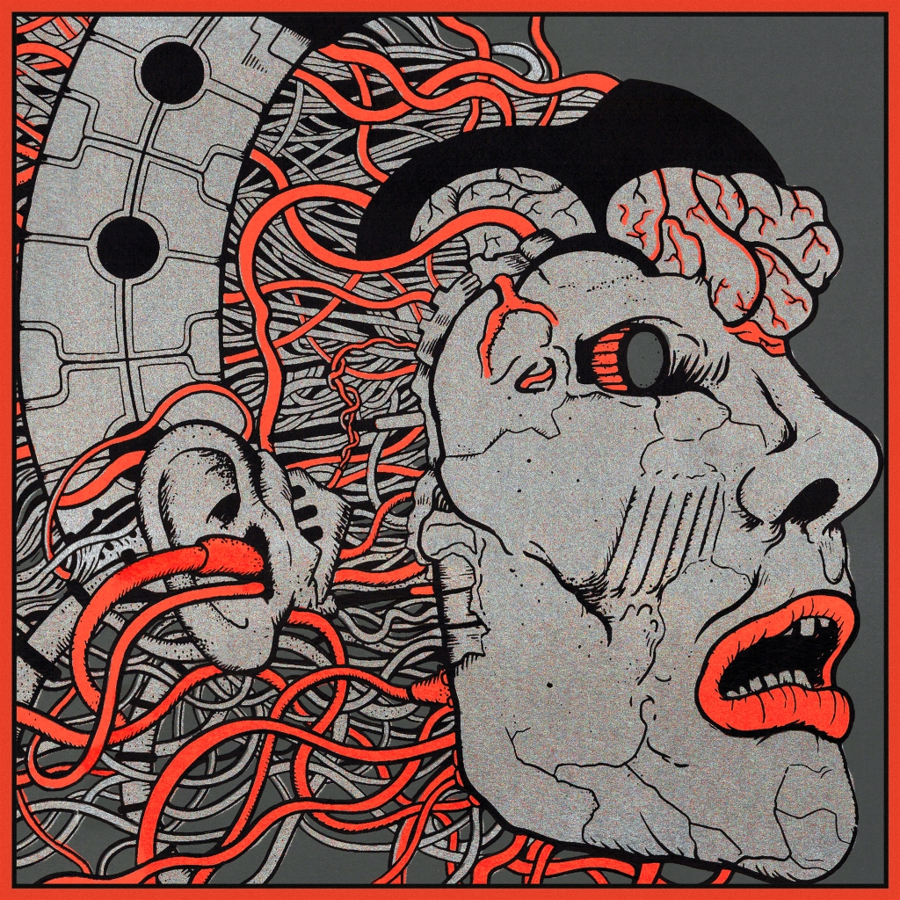

Release Date: 24 December 2020

Recorded live at [Alexandra Palace, London, England, October 5th 2019](../setlists/2019/10/05/alexandra-palace-london-england.html). The 10,000 capacity venue hosted KGATLW’s biggest ever live show at the time. The band were promoting [Infest The Rats Nest](../infest-the-rats-nest), and recording material for [Chunky Shrapnel](../chunky-shrapnel) through this tour, the set-list for this landmark show is full of heavy staples and concludes with a shortened 10 minute version of Float Along — Fill Your Lungs ([Float Along — Fill Your Lungs](../float-along-fill-your-lungs)). Compared with the other 2019 live albums it has notably higher audio quality with well mixed crowd sounds.

What to listen to next:

*   [If you want to hear the live album compiled from this whole tour](../chunky-shrapnel)
*   [If you want to hear another full show from this tour](../live-in-asheville-2019)
