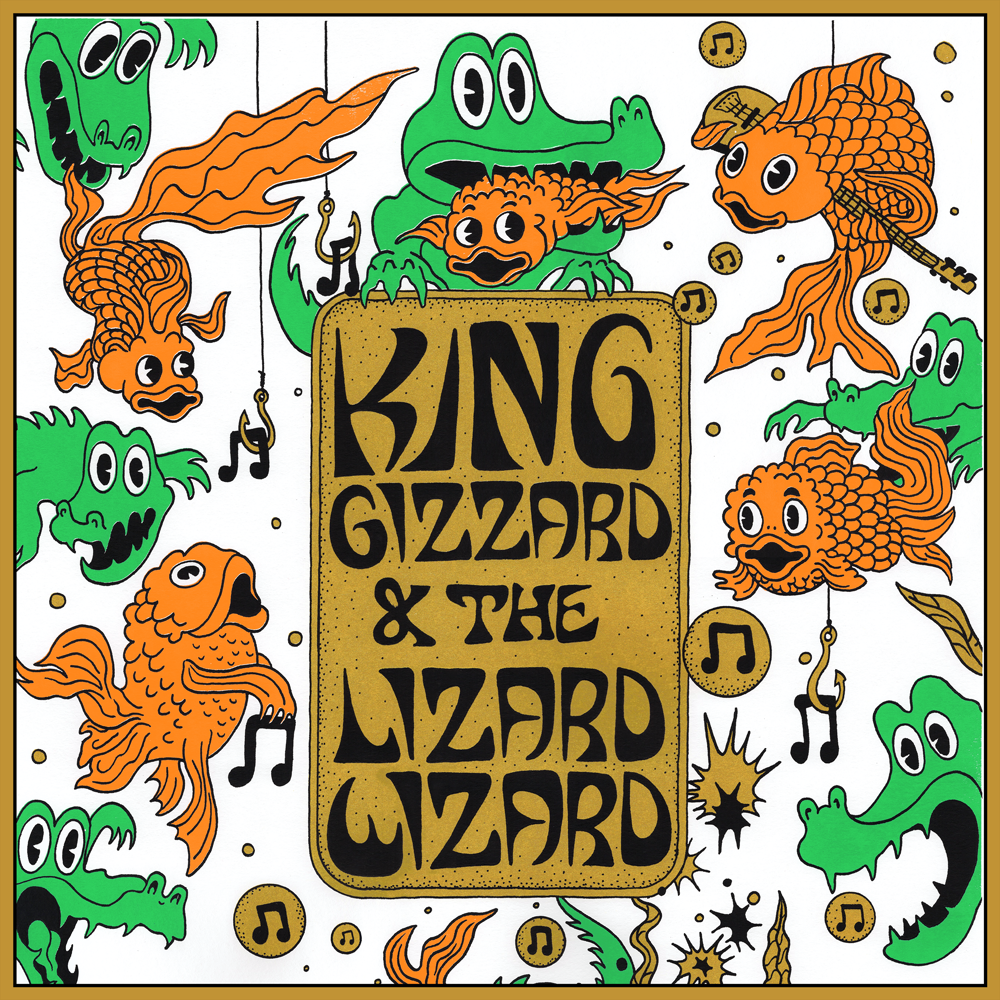

Release Date: 1 October 2021

Recorded live at Riverside Theatre, Milwaukee, WI, USA, August 23rd 2019 and released October 1, 2021. The band were promoting [Infest The Rats Nest](../infest-the-rats-nest), and recording material for [Chunky Shrapnel](../chunky-shrapnel) through this tour – but leading up to the original planned marathon jam shows of 2020 the set-lists tended to be notably diverse, including throwbacks, rarities and alternate versions of fan favourites. For this performance, these include: Stressin’ ([Oddments](../oddments)), Down The Sink with very rare vocals from Cook ([Gumboot Soup](../gumboot-soup)), Acarine ([Fishing For Fishies](../fishing-for-fishies)), and concluding with the longest version of Head On – Pill to date, at just over 30 minutes ([Float Along — Fill Your Lungs](../float-along-fill-your-lungs)).

What to listen to next:

*   [If you want to hear the live album compiled from this whole tour](../chunky-shrapnel)
*   [If you want to hear another full show from this tour](../live-in-london-2019)
