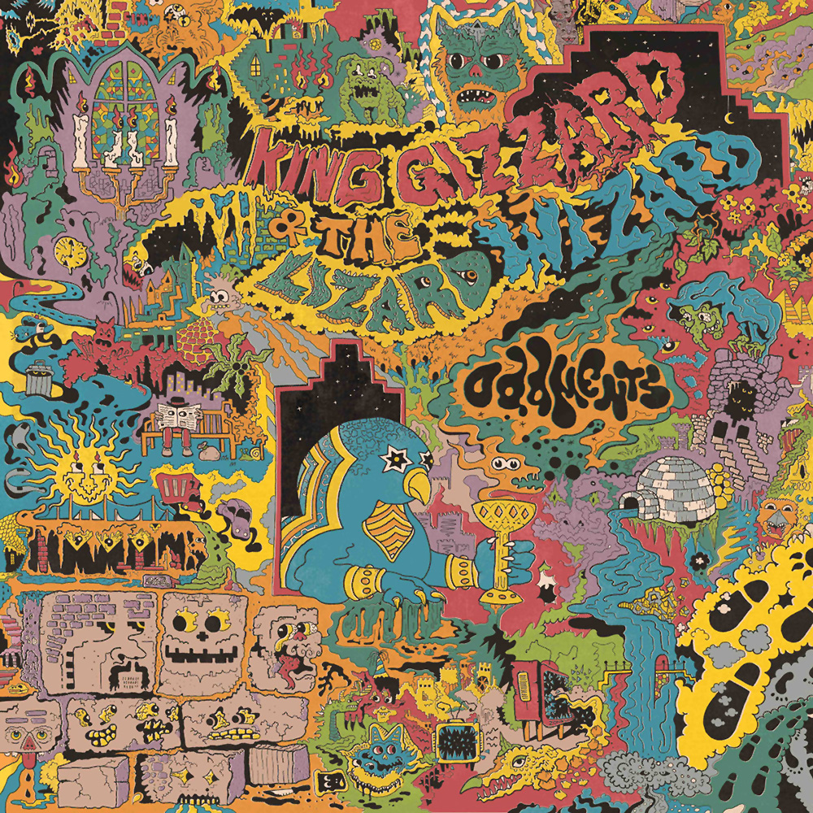

> It's kind of funny  
> That I live the poetry I can not write  
> But you, my beauty  
> Shall be fixed forever loosely in my heart

Release Date: 7 March 2014

Oddments is a loose collection of lo-fi psych songs that were created outside of other whole album projects or for abandoned concepts. Representing several paths that the band never went down, these are some of the most unique KGATLW songs that tie up the loose ends of their early period for bigger and better sounding projects.

The first opus of Jason Galea, this intricate artwork spreads over the triple gatefold of the first vinyl issue with its own little world of idiosyncratic characters.

What to listen to next:

*   [If you want a newer more hi-fi eclectic concept-less album](../gumboot-soup)
*   [If you want the newest eclectic concept-less album](../omnium-gatherium)
*   [If you want to move on from the lo-fi early period](../im-in-your-mind-fuzz)
*   [If you want more chill songs](../paper-mache-dream-balloon)
*   [If you want another ‘fun’ album](../fishing-for-fishies)
