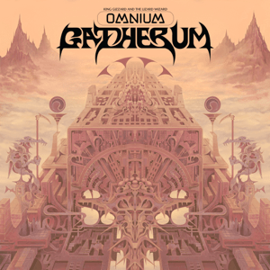

> I am tectonic  
> I am megalithic  
> My spirit runs mauve  
> I am the mountain of which you dream

Omnium Gatherum wraps up the last of the pandemic lockdown-era isolation songs with the results of the first recording sessions with the band all back together jamming in the same room. omnium-gatherium is an eclectic mixture of sounds that blurs the lines between some of their most retrospective sounding songs, and some of their boldest, off-the-wall experimentation.

This blurring is a product of the high volume of live show rehearsals by the band in preparation for their first live performances in two years. The heavily delayed marathon jam shows of March 2020 were originally intended as the ultimate reflection of an already accomplished career, and the fixation on finally fulfilling this goal has seen KGATLW re-emerge as a ‘jam band’. Resulting in an album that feels more complementary to the tours that are now enhanced with extended jam versions of fan favourites, guitar solos, and new songs that can serve as live segues between disconnected older material.

What to listen to next:

*   [If you want the first eclectic concept-less album](../oddments)
*   [If you want another eclectic concept-less album](../gumboot-soup)
*   [If you liked the heavy songs](../infest-the-rats-nest)
