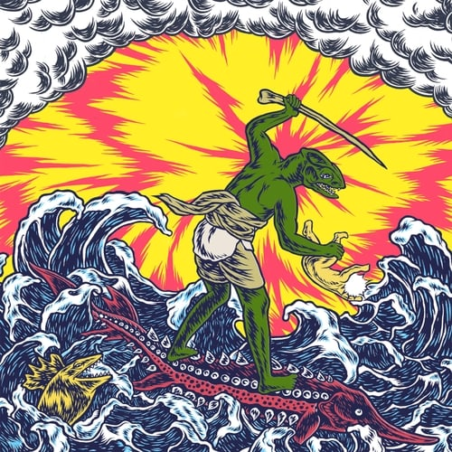

Release Date: 25 December 2020

Teenage Gizzard is a compilation of the earliest recorded and self published material from the band up until the [Willoughby’s Beach](../willoughbys-beach) EP – sounding similar to that release, the songs are highly characteristic of the era: fast, raw, and simple.

Including the Angelsea EP, the ‘Hey There / Ants & Bats’, and ‘Sleep / Summer’ singles, and other ‘loosies’ such as Trench Foot, originally published in the Anti Fade Records _New Centre Of The Universe Vol. 1_ compilation. Until their publication in the bootlegger program, many of these songs were ‘lost’ and unheard by most fans, existing pretty much only as hand made cassette and CD releases for local distribution; and in some cases had to be ripped back off these releases in the absence of original master recordings.
