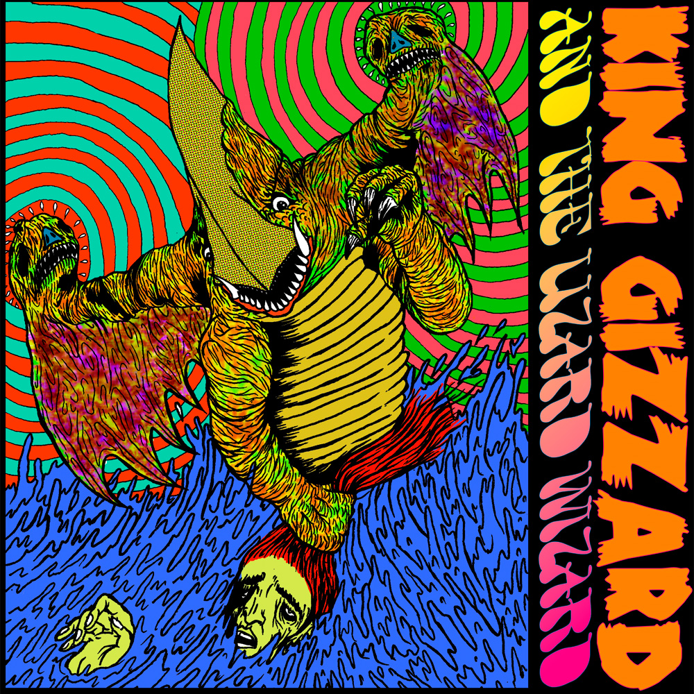

Release Date: 21 October 2011

The precursor to debut album [12 Bar Bruise](../12-bar-bruise), this EP is an even rougher blend of Surf-Punk with little of the psychedelic elements KGATLW would become known for. Named after a beach local to some of the group members, it shows the roots of the group’s formation as an underground party band.

What to listen to next:

*   [If you want to continue with the evolution of the band](../12-bar-bruise)
*   [If you want to hear more rough early material](../teenage-gizzard)
